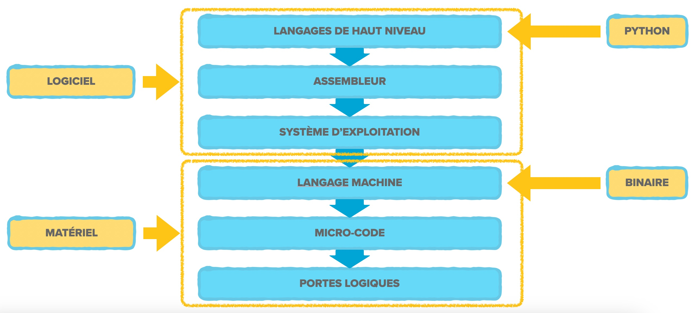
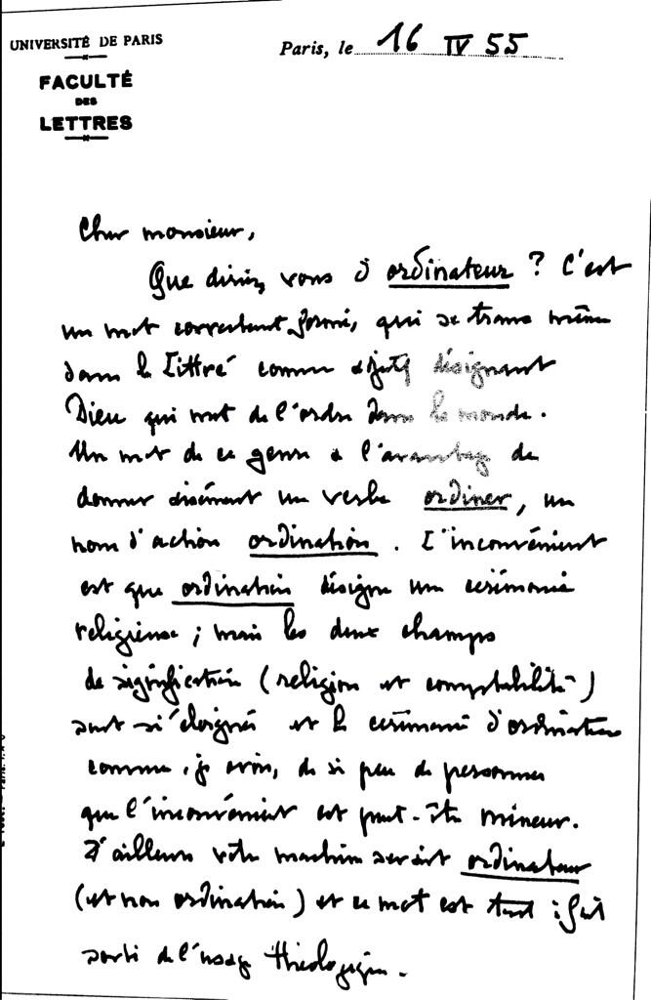
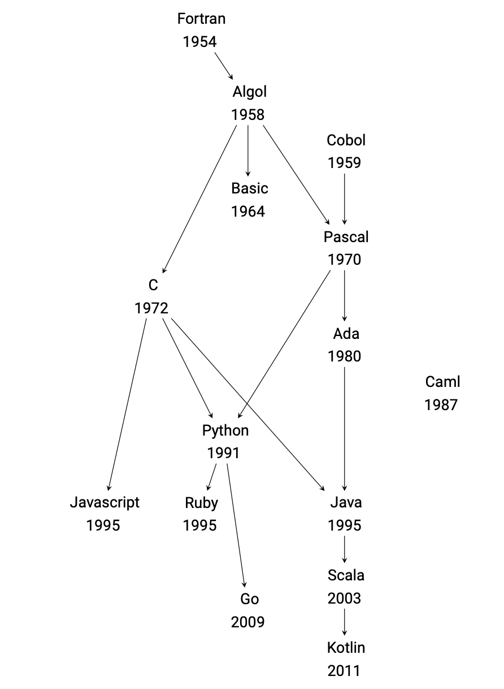
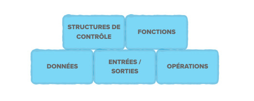

## Préambule

Bienvenue dans le cours **Algorithmique et Programmation 1** !

### Pour qui ? Pour quoi ?

Ce cours est destiné en particulier aux étudiant.e.s ayant peu d'expérience en programmation.

Il va couvrir les bases de la programmation *impérative*, à travers le langage de programmation *Python* (3), ainsi que constituer une introduction à la discipline (et à la pensée) algorithmique.

Ces notes sont pensées pour accompagner, enrichir et détailler les transparents présentés en *cours magistral* (CM). Les transparents sont aussi disponibles en consultation en ligne ou au téléchargement.

Elles sont en grande partie basées sur les notebooks des années précédentes, rédigées principalement par Antoine Meyer. 

Bonne découverte et bon semestre !

*Marie et Léo*

#### Trouver des informations

-   **Contacts** (à chercher dans [l'annuaire](https://pagespro.univ-gustave-eiffel.fr/)) :
    - Responsable de formation : Antoine Meyer
    - Secrétaire de formation : Ramatoulaye Barry ( ramatoulaye.barry@univ-eiffel.fr)  (absence, pb admin, ...)
    - Responsables de l'UE : Marie van den Bogaard et Léo Exibard
    
-   **Page web** :
    -   https://elearning.univ-eiffel.fr/course/view.php?id=9175
    -   Ressources diverses (ouvrages, liens, annonces)
    -   Sujets des TD, des TP, liens vers les supports de cours
    
-   **Communication** : 
    - Discord : https://discord.gg/6jrfmUwcSp
    - Mail : *exclusivement* sur votre adresse <<vous@edu.univ-eiffel.fr>>
    - *Webmail* : http://partage.univ-eiffel.fr

### Programme et références

Ce cours recouvre très largement la partie *Langages et programmation* du programme de l'option de spécialité NSI de première générale proposée par les (des) lycées français. Certaines notions des parties *Algorithmique*, *Représentation des données* et *Histoire de l'informatique* seront aussi abordées. (cf. https://www.education.gouv.fr/media/23690/download)

Beaucoup de ressources sont disponibles pour apprendre et approfondir les concepts présentés dans ce cours. Nous recommandons notamment le livre *Informatique :Inf*, collection *Fluoresciences*, éditions *Dunod*, partie 1 *Mathématiques pour l'Informatique* et partie 2 *Algorithmique et Programmation*, disponible à la bibliothèque universitaire Georges Pérec. 
Le livre pdf gratuit de G. Swinnen, *Apprendre à programmer avec Python 3*, dont le lien se trouve sur la page e-learning du cours, peut aussi s'avérer pertinent pour le lecteur curieux.

En (très) résumé, voici les notions abordées dans la suite de ces notes et pendant les séances de CMs, TDs et TPs:

   - Notion d'**algorithme** : définition, intérêt, exemples, mise en oeuvre 
   - Briques de base de la **programmation impérative** : variables, assignation, expressions, opérations, structure de contrôle, représentation des données (types simples, types construits, structures de données), fonctions
   - Outils mathématiques et de raisonnement : bases de numération, arithmétique "euclidienne" (division entière, reste, modulo, ppcm, pgcd), booléens et valeurs de vérités
   - Machinerie Python : syntaxe, fonctionnement de la mémoire, méthodes utiles, listes, dictionnaires 
   - Bonnes pratiques de programmation : Règles de style, Prototypage, Découpage en sous-tâches, Documentation, Tests
   - (en bonus, si le temps le permet : une introduction au concept de *récursivité*)


# Introduction 
## Une histoire de zéros et de uns...

ou *du binaire aux langages de programmation*

ou *comment en est-on arrivé là ?*


Dans cette section, nous allons essayer d'éclairer l'écart entre le monde des *bits* et le monde des langages de programmation *haut niveau*, comme le Python.
La majorité des gens ont en effet une vague idée du fait que l'*informatique*, ou même l'*ordinateur*, "ça marche avec des *zéro*s et des *un*s". 

Ce petit morceau de vulgarisation scientifique dans la culture générale, bien que raisonnable, est parcellaire et très éloigné de la réalité de nos interactions avec l'informatique.
Réalité quotidienne d'une grande partie de l'humanité : utilisation d'applications sur nos ordinateurs, téléphones et montres pour réaliser tout un tas de tâches (communication, divertissement, administratif, apprentissage, graphisme...), mais aussi réalité quotidienne pour une partie beaucoup plus restreinte de l'humanité: les *informaticien.ne.s* !

Concrètement, depuis très longtemps (à l'échelle de l'histoire de l'informatique), les informaticien.ne.s ne manipulent pas de 0 et de 1 (de *bits*) "à la main" (ou alors très rarement, on verra cela).
En particulier, en programmation, on utilise en pratique des langages qu'on appelle de *haut niveau* : des langages qui sont relativement compréhensibles à la lecture par un être humain initié. 
On comprend donc mieux les programmes, et on les écrit aussi plus facilement.

D'accord, mais on nous avait donc menti avec ces histoires de zéros et de uns?

Non ! Ils sont toujours là, mais entre eux et ce que nous programmons, il y a plusieurs couches, ou strates, de traductions (et un peu d'électronique).
Nous ne rentrerons pas dans les détails dans ce cours (les UE d'architecture et de compilation le feront en partie), mais voici une figure qui représente ces différentes strates.
    

{ width=100% }

Nous allons donc nous intéresser à la couche supérieure de ce schéma, celle des langages de programmation de haut niveau. Vous savez déjà probablement qu'il en existe plusieurs, et en fait, une *multitude* (dont le Python). 
Disons-en un peu plus sur cette multitude avant de passer au contenu algorithmique et technique.

### De l'universel au particulier

On a vu superficiellement qu'à partir de la strate "langage machine", tout s'exprimait effectivement en binaire.
C'est vrai pour les données, mais aussi pour les programmes ! Or, il est impossible pour le cerveau humain de lire/comprendre/écrire une telle diversité de signifiants encodés avec un alphabet aussi petit (on le rappelle, seulement deux lettres, `0`et `1`).
Surtout quand on sait qu'un des objectifs de l'informatique, c'est de traiter beaucoup d'information, ou effectuer beaucoup de calculs, de manière automatique et rapide. 
Très vite, les langages de programmation ont vu le jour : en 1954, le bal commence avec **Fortran**.
C'est un an *avant* le choix du mot **ordinateur** pour parler de *computer* en français.

{ width=70% }

Puis la création de nouveaux langages s'accelère, chacun ayant ses propres spécificités qui le rendent plus ou moins adapté à telle ou telle application.
Par exemple, le *COBOL*, créé en 1959, est particulièrement robuste et fiable pour manipuler des grandes quantités de données structurées, et il est donc encore utilisé à ce jour dans les banques, les assurances et certaines administrations.

Le langage *C*, quant à lui, permet de contrôler de manière assez fine l'utilisation de la mémoire, et ainsi d'être très performant et économe en ressources. Cette liberté d'usage de la mémoire le rend peut-être moins accessible aux débutants, et même un peu dangereux si l'on est pas prudent ! En revanche, il permet justement d'apprendre la rigueur et d'approfondir certains concepts fondamentaux de programmation : c'est pourquoi vous vous plongerez dedans dès la L2, si vous choisissez le cursus informatique à l'issue de la L1.

Enfin, le **Python** : né en 1991, il est beaucoup utilisé pour mettre en place des programmes rapidement. Il est (relativement) simple et peu verbeux, ce qui le rend particulièrement adapté à l'apprentissage de la programmation et à l'écriture de *scripts* (programme simple souvent conçu pour automatiser des tâches élémentaires). C'est lui qui est notre langage de référence dans ce cours, et que l'on va s'employer à maîtriser de plus en plus.

La figure ci-dessous montre un échantillon de la généalogie des langages de programmation :

{ width=70% }

##### Un mot sur les *paradigmes* de programmation

- À votre avis, pourquoi est-ce que le *Caml* est tout seul dans son coin ?

La réponse vague : à cause des *paradigmes* de programmation. Cette expression un peu terrifiante veut simplement dire qu'il existe plusieurs *style* de programmation, différentes manières de concevoir les programmes.

Ainsi, dans la programmation **impérative**, on va indiquer une série d'instructions à exécuter étape par étape.
Intuitivement, on explique *quoi* faire et *comment* en donnant des instructions précises. Les premiers langages de programmation sont dans ce style, mais pas seulement! Le **C** et le **Python** sont des exemples de langages qui peuvent mettre en oeuvre ce paradigme. En fait, la plupart des langages contiennent ce qu'il faut pour programmer de manière impérative, et on peut voir ce paradigme comme l'ensemble des briques de bases de l'algorithmique et de la programmation. C'est d'ailleurs pour cette raison que nous allons explorer cette façon de programmer dans ce cours.

On peut aussi citer la programmation **orientée objet**, dans laquelle on est centré sur le concept d'*objet* qui a des propriétés et des méthodes pour agir et interagir avec l'extérieur et avec lui-même. Le **Java** (que vous verrez en L3) et le **C++** (que vous pourrez voir en master) sont des langages de ce type. On peut aussi programmer en orienté objet avec Python, mais cela ne sera pas abordé dans ce cours.

Enfin, la programmation **fonctionnelle** est elle centrée sur le concept de *fonction* : très proche des mathématiques, cette façon de penser peut être pertinente pour écrire des programmes très élégants. Le Caml fait partie de cette famille de langages, tout comme le Haskell que vous pourrez aborder en L3.


## Briques de base d'algorithmique  

Voici un aperçu des briques de base, qui vont nous occuper pour tout le semestre :

{ width=100%}

Un programme informatique traite des **données** pour en extraire de l'information. Elles peuvent être déjà stockées quelque part, ou bien fournies par l'utilisateur auquel cas on parle d'**entrées** (avec le clavier, la souris, etc). Le programme peut également interagir avec l'utilisateur, par exemple en affichant quelque chose à l'écran ou en commandant l'impression d'un document (les **sorties**).

Penchons-nous maintenant sur la manière dont le programme traite les données : essentiellement, un programme consiste en une suite d'**instructions**, qui peuvent être répétées ou encore exécutées en fonction de certaines conditions, conformément aux **structures de contrôle** du programme (instructions conditionnelles, boucles `for` et `while`). Enfin, certaines parties du programme peuvent être isolées dans des **fonctions** pour être réutilisées et améliorer la lisibilité du code.

### À quoi ça correspond en Python ?
Tout cela est peut-être un peu abstrait. Nous approfondirons chaque notion au fil de l'année, mais voici quelques indications pour vous donner une idée, à la lumière de ce que vous avez vu et verrez en TD et en TP (et éventuellement de ce que vous savez déjà de Python) :

- Données : c'est l'entrée du programme, par exemple les variables globales et les informations stockées dans des fichiers
- Entrées-sorties : vous pouvez demander une entrée à l'utilisateur via la fonction `input()`, et afficher des éléments à l'écran avec `print()`. Nous verrons des méthodes plus élaborées (par exemple via des interfaces graphiques) avec `fltk`.
- Opérations : les opérations arithmétiques `+`, `-`, `*`, `/`, etc ; logiques `and`, `or`, `not` ; la concaténation `+` ; et tout un tas d'opérations plus compliquées que nous verrons au fil de l'année.
- Fonctions : vous avez déjà pu manipuler `input` et `print` pour les entrées-sorties, ainsi que `int` et `str` pour convertir en entier et en chaîne de caractère, nous en verrons de nombreuses autres !
- Structures de contrôle : il s'agit des instructions conditionnelles `if: ... else: ...`, des boucles `for ... in ...` et des boucles `while ...:`.

Mais pas de panique, nous allons voir tout cela en détail en CM !


# Un peu plus sur Python

C'est parti pour expliciter les premières briques dans le langage Python. La suite est un catalogue présentant les outils et notions pratiques à connaître pour comprendre et écrire de premiers programmes en Python.

## Types de valeurs 

Toutes les valeurs en Python possèdent un **type**. Le type d'une valeur définit les **opérations** possibles.
Les types de base sont :

* les nombres entiers (`int`) ou décimaux (`float`)
* les booléens (`bool`)
* les chaines de caractères (`str`)
* un type de valeur indéfinie (`NoneType`)

Voici quelques exemples de valeurs pour chaque type, on vous conseille de tester ces valeurs dans la version interactive de Python. (celle qui s'active quand vous tapez la commande `python` ou `python3` dans votre terminal)

### Nombres entiers (`int`)


```python
>>> 6
6
```

```python
>>> 12345
12345
```


```python
>>> -4  # un entier négatif
-4
```


```python
>>> 2 ** 1000  # un très très grand entier
10715086071862673209484250490600018105614048117055336074437503883703510511249361224931983788156958581275946729175531468251871452856923140435984577574698574803934567774824230985421074605062371141877954182153046474983581941267398767559165543946077062914571196477686542167660429831652624386837205668069376

```


```python
>>> 0b101010  # un entier en binaire
42
```


```python
>>> 0x2a  # un entier en hexadécimal
42
```


### Nombres décimaux (`float`)


```python
>>>  3.14
3.14
```


```python
>>> -1.5
-1.5
```


```python
>>> 3 * .1  # un nombre décimal qui ne "tombe pas juste"
0.30000000000000004
```


```python
>>> 12.
12.0
```


```python
>>> 4.56e3  # notation scientifique
4560.0
```


### Booléens (`bool`)

Ce type permet de représenter les deux valeurs de vérité « vrai » et « faux ». 


```python
>>> True  # vrai
True
```


```python
>>> False  # faux
False
```


{ width=50px } **Attention :** Les majuscules/minuscules sont importantes :


```python
>>> true  # provoque une exception (une erreur)
---------------------------------------------------------------------------

NameError                             
Traceback (most recent call last)

Cell In[14], line 1
----> 1 true  # provoque une exception (une erreur)


NameError: name 'true' is not defined
```


    


### Chaînes de caractères (`str`)

Une chaine de caractères est une succession de symboles (lettres, chiffres, ou autres) entre guillemets


```python
>>> 'bonjour' 
'bonjour'  # guillemets simples
```


```python
>>> "hello !"  # guillemets doubles
"hello !"
```


Il faut faire un peu attention pour écrire une chaîne de caractères contenant des apostrophes ou des guillemets :


```python
>>> "King's Landing"
"King's Landing"
```


```python
>>> 'Mon nom est "Personne".'
'Mon nom est "Personne".'
```

**Caractères spéciaux :** `\n, \t, \', \", \\`


```python
>>> 'sauts\nde\nligne'
'sauts\nde\nligne'
```


```python
>>> print("sauts\nde\n ligne")
sauts
de
ligne
```


```python
>>> print("Du\tsur\ntexte\t2 colonnes")
Du	    sur
texte	2 colonnes
```


```python
>>> print("D'autres symboles spéciaux : \' \" \\")
D'autres symboles spéciaux : ' " \
```

**Chaînes longues :**

```python
>>> """Ce plat est supposé être dégusté au petit-déjeuner 
mais convient aussi comme dessert. Les pancakes sont 
traditionnellement accommodés avec du sirop d'érable 
et une noix de beurre mais rien n'empêche de les 
dévorer au sucre, au jus de citron ou avec de la pâte 
à tartiner."""
"Ce plat est supposé être dégusté au petit-déjeuner \nmais convient aussi comme dessert. Les pancakes sont \ntraditionnellement accommodés avec du sirop d'érable \net une noix de beurre mais rien n'empêche de les \ndévorer au sucre, au jus de citron ou avec de la pâte \nà tartiner."
```

### Valeur indéfinie (`NoneType`)


```python
>>> None  # ça a l'air inutile mais en fait c'est bien pratique
```


```python
>>> print(None) 
None
```

## Opérations 

Le type d'un objet détermine les **opérations** qu'on peut lui appliquer. 

C'est un principe *très important* en Python.

### Opérations sur les nombres

Addition (`a + b`), soustraction (`a - b`), multiplication (`a * b`), puissance (`a ** b`)
- sur deux `int` et produisant un `int`
- ou sur deux `float` et produisant un `float`
- ou sur un `int` et un `float` et produisant un `float`


```python
>>> 4 + 5
9
```


```python
>>> 4 - 5.5
-1.5
```


```python
>>> 4. * 5.
20.0
```


```python
>>> 4 ** 2
16
```


```python
>>> 4 ** 0.5
2.0
```

Division "réelle" (`a / b`) : produit toujours un `float`


```python
>>> 1 / 3  # valeur approchée !
0.3333333333333333
```


```python
>>> 4 / 2  # ne donne pas un entier !
2.0
```

Division euclidienne :
- **quotient** : `a // b`
- **reste**, ou **modulo** : `a % b`
- les deux en même temps : `divmod(a, b)`
- si `a` et `b` de type `int`, produisent un `int`, sinon un `float`


```python
>>> 7 // 2
3
```


```python
>>> 7 % 2
1
```


```python
>>> divmod(7, 2)
(3, 1)
```


```python
>>> 4 // 2  # cette fois c'est un entier...
2
```


```python
>>> 4 % 2  # le reste est nul car 4 est pair (divisible par 2)
0
```


```python
>>> 4.0 // 1.75  # donne un float !
2.0
```


```python
>>> 4.0 % 1.75
0.5
```

Les opérations suivent les règles de priorité usuelles :


```python
>>> 4 + 2 * 1.5
7.0
```

On peut aussi utiliser des parenthèses : 


```python
>>> (4 + 2) * 1.5
9.0
```

### Opérations sur les chaînes de caractères

Concaténation : `s + t`


```python
>>> 'Gustave' + 'Eiffel'
'GustaveEiffel'
```


```python
>>> 'Gustave' + ' ' + 'Eiffel'
'Gustave Eiffel'
```

Répétition : `s * a` 


```python
>>> 'Hip ' * 3 + 'Hourra !'
'Hip Hip Hip Hourra !'
```


```python
>>> ('Hip ' * 3 + 'Hourra ! ') * 2
'Hip Hip Hip Hourra ! Hip Hip Hip Hourra ! '
```

Beaucoup d'autres opérations (sur les chaînes, les nombres...) : *on verra ça plus tard*

{ width=50px } Le sens de `*` et `+` n'est pas le même sur les chaînes et sur les nombres !

### Conversions / transformations de type

On a parfois besoin de convertir une valeur d'un type à l'autre

- N'importe quel objet en chaîne avec la fonction `str`


```python
>>> "J'ai " + 10 + ' ans.'
Traceback (most recent call last):
  File "<stdin>", line 1, in <module>
TypeError: can only concatenate str (not "int") to str
```


```python
>>> "J'ai " + str(10) + ' ans.'
"J'ai 10 ans."
```

-   Un `float`, ou *parfois* un `str` en `int`  


```python
>>> int(3.5)  # float vers int
3
```


```python
>>> int('14')  # str vers int
14
```


```python
>>> int('3.5')  # impossible : deux conversions (str -> float -> int)
Traceback (most recent call last):
  File "<stdin>", line 1, in <module>
ValueError: invalid literal for int() with base 10: '3.5'
```


```python
>>> int('deux')  # impossible : ne représente pas un nombre
Traceback (most recent call last):
  File "<stdin>", line 1, in <module>
ValueError: invalid literal for int() with base 10: 'deux'
```

-   Un `int`, ou *parfois* un `str` en `float`


```python
>>> float(3)  # int vers float
3.0
```


```python
>>> float('14.2')  # str vers float
14.2
```


```python
>>> float('3,5')  # impossible : virgule au lieu de point
Traceback (most recent call last):
  File "<stdin>", line 1, in <module>
ValueError: could not convert string to float: '3,5'
```


```python
>>> float('bonjour')  # impossible : ne représente pas un nombre
Traceback (most recent call last):
  File "<stdin>", line 1, in <module>
ValueError: could not convert string to float: 'bonjour'
```

### Déterminer le type d'une expression

Grâce à la fonction prédéfinie `type`


```python
>>> type("salut")
<class 'str'>
```


```python
>>> type(4 / 2)
<class 'float'>

```


```python
>>> type(2 * 4.8)
<class 'float'>

```

#### Exercice : valeur et type d'une opération

Pour chacune des instructions suivantes :
1. donner le type et le résultat de l'expression donnée ;
2. vérifier le résultat.

On pourra utiliser la fonction `type` si nécessaire pour vérifier le type du résultat.


```python
2 * 5
```


```python
2 + 1.5
```


```python
2.0 * 4
```


```python
'2.0' * 4
```


```python
'2.0' * 4.0
```


```python
4 / 2
```


```python
4.0 / 2
```


```python
5 / 2
```


```python
5 % 2
```


```python
5 // 2
```


```python
int(4.0) / 2
```


```python
str(4) / 2
```


```python
'toto' + str(4)
```


```python
float(4) * 2
```


```python
int(str(4) * 2)
```


```python
'toto' + 'titi'
```


```python
int('toto') + 'titi'
```


```python
int(2.0) * 4
```


```python
'toto' * str(4)
```


```python
int('1.25')
```


## Variables et affectations 

Une **variable** est un *nom* servant à désigner une valeur
- Une variable est remplacée par sa valeur dans les calculs
- Seules les opérations du type de la valeur sont permises

L'**affectation** est le fait de lier une *valeur* à une *variable*
-   Syntaxe : `nom =` *une expression*  
     **Attention :** Ce n'est pas *du tout* le = des mathématiques, il faut le lire comme "prend la valeur"


```python
x = 3
y ='UGE'
z = x + 2
x, y, z
```

-   On peut *réaffecter* une variable (même avec une valeur d'un type différent)  


```python
>>> x
3
```


```python
x = 'UGE'

```


```python
>>> x
'UGE'
```

-   On ne peut utiliser une variable que si elle a été préalablement définie !


```python
>>> foo
Traceback (most recent call last):
  File "<stdin>", line 1, in <module>
NameError: name 'foo' is not defined
```


