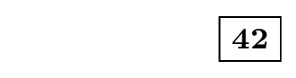
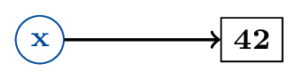
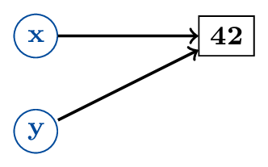
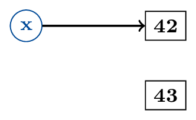
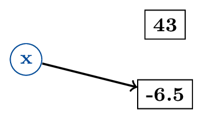
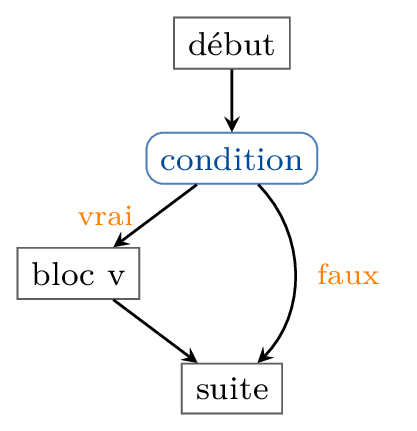
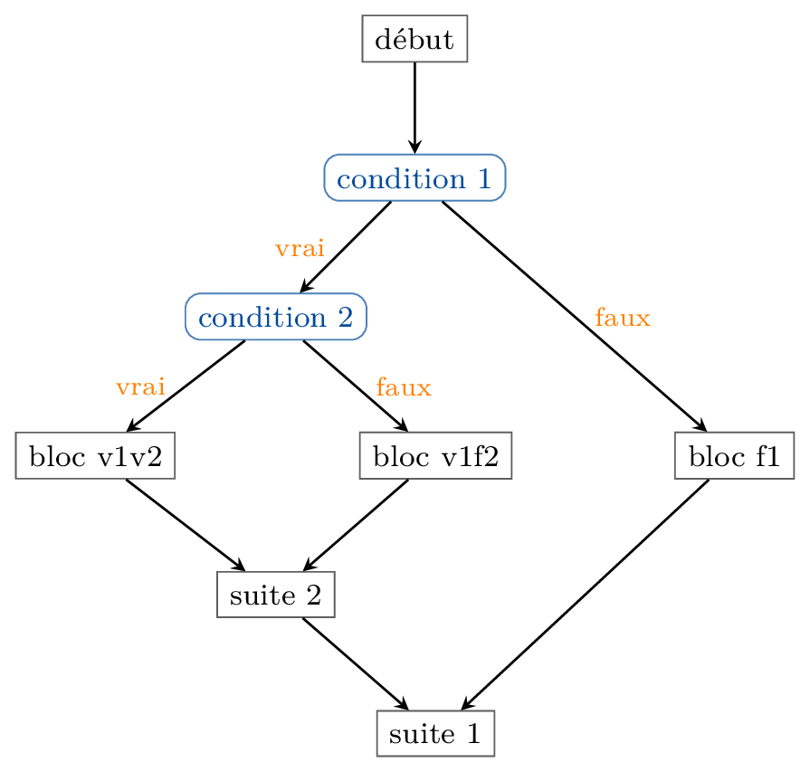

## Modèle de mémoire de Python 

*Modèle de mémoire : une image simplifiée de la manière dont fonctionne la mémoire de l'interpréteur Python*

Deux zones principales :
- la zone des données (le « tas », en anglais *heap*)
- la zone des espaces de noms (la « pile », en anglais *stack*)

Dans Python Tutor : pile à gauche, tas à droite

**Le tas**

Le tas est comme un *très* gros cahier dans lequel sont décrits les objets manipulés par un programme:

- Chaque objet décrit dans le cahier commence à un certain numéro de page, qu'on appelle son *adresse*
- Certaines pages sont blanches, d'autres sont remplies

**La pile**

La pile est comme l'index du cahier:

- À chaque variable est associé le numéro de page d'un objet
- Un groupe de variables et les numéros de page correspondants est appelé **espace de noms**
- La pile contient l'espace de noms **global**, contenant les noms définis par nos programmes 
   *(en réalité la pile contient aussi d'autres espaces de noms, on en reparlera)*


```python
x = 3
y ='UGE'
z = x + 2
```
**La notion d'état**

L'**état** de l'interpréteur pendant l'exécution c'est: 

- le numéro de la ligne suivante à exécuter dans le programme
- le contenu de diverses variables internes de l'interpréteur
- le contenu de la pile (donc tous les espaces de noms)
- le contenu du tas (donc toutes les données du programme)

à un moment donné. Les **instructions** modifient généralement l'état.

### Étapes d'une affectation 

**Affectation simple**


```python
x = 40 + 2
```

1.  Évaluation de l'expression à droite du `=` (ici `42`)
{width=30%}
La valeur `42` de type `int` est stockée dans le tas *(écrite sur une page du cahier)*

2. Création du nom `x` dans l'espace de noms (sauf s'il existe déjà)

{width=50%}
   
   On ajoute `x` à la pile *(on ajoute une ligne pour `x` à l'index du cahier)*

3. Création du lien entre *variable* et *valeur*
{width=50%}   
   L'adresse de l'objet `42` est associée à la variable `x` *(on écrit dans l'index le numéro de la page contenant l'objet `42` à `x`)*


**Deuxième exemple**


```python
y = x
```

 Dans cet exemple le `x` en partie droite de l'affectation désigne la **valeur** actuellement associée à la variable `x` !

1. Calcul du *membre droit* après remplacement de chaque variable par la valeur associée (ici `x` remplacé par `42`)
    {width=50%}

2. Création du nom `y` (sauf si déjà créé) 
    {width=50%}

3. Création du lien entre `y` et `42`
    {width=50%}


**Troisième exemple**


```python
x = x + 1
```

 Dans cet exemple, le `x` de gauche désigne le nom `x` lui-même, mais celui de droite désigne la **valeur** actuellement associée à `x`

1. Calcul du *membre droit* après remplacement de chaque variable par la valeur associée (ici `x` remplacé par `42`, résultat : `43`)
    {width=50%}

2. Nom `x` déjà existant, création du lien entre `x` et 43
    {width=50%}


 **Piège !**

Que vaut maintenant `y` ?


```python
y

```

Même si `x` et `y` désignaient avant le même objet (la même adresse, le même *numéro de page*), changer la page que désigne `x` n'a aucun effet sur `y` ! On n'a pas *modifié* l'objet 42, qui est toujours là !


```python
x = 40 + 2
y = x
x = x + 1
```

**Remarque :** L'instruction `x = x + 1` peut aussi s'écrire `x += 1`. On appelle cela une **incrémentation** de `x`.


```python
x += 1
```

De même, `x *= 2` est une version plus concise de `x = x * 2`.

**Dernier exemple**


```python
x = -6.5
```

{ width=50% }

####  Quelques points de détail

- On peut réaffecter une valeur de type différent à une variable (comme dans le dernier exemple)
- En cas de réaffectation, le lien précédent est oublié
- Quand aucun lien n'existe vers un objet, il est "détruit" par le ramasse-miettes ou *garbage collector* (la page est effacée !)

### Exercice : état de la mémoire après une suite d'affectations

Dessiner l'état de la mémoire à l'issue des instructions suivantes :


```python
x = 2
y = 3
x += y
y *= 2
```

### Nommage des variables

Règles de nommage des variables :

- Commencent par une *lettre*, suivie de *lettres et de chiffres*
- Le caractère *underscore* `'_'` est considéré comme une lettre
- Éviter les caractères spéciaux (accents, cédille, etc.)
- Les *mots réservés* (ou mots-clés) de Python sont interdits
- Il y a aussi des **conventions** (*vues plus tard*)

*Exemples :*  `_ex2   Ex2mpl1`

*Contre-exemple :*  `2024eiffel`

### Mots-clés et autres mots réservés

Les mots suivants sont **réservés** pour le langage :

```python
False      await      else       import     pass
None       break      except     in         raise
True       class      finally    is         return
and        continue   for        lambda     try
as         def        from       nonlocal   while
assert     del        global     not        with
async      elif       if         or         yield
```

[voir la doc](https://docs.python.org/fr/3/reference/lexical_analysis.html#keywords)

### Exercice : nommage de variables

Indiquer parmi les mots suivants ceux qui ne sont pas des noms valides pour une variable :
  
```python
    bonjour                Hi!                  au revoir              
    Ciao                   NON                  byeBye7               
    abc                    def                  6hello6                
    good_morning           __repr__             good-afternoon         
	f()					   6hello6.             _upem_
```


## Saisie et affichage 

Fonction de saisie : `x = input("Veuillez rentrer ...")`
  
- L'utilisateur tape une ligne au clavier
- La ligne est stockée sous forme de chaîne de caractères (`str`)
- Cette valeur peut ensuite être affectée à une variable (ici `x`)
- Le message d'invite pour l'utilisateur est facultatif

[doc](https://docs.python.org/fr/3/library/functions.html#input)


```python
nb_personnes_ref = 2
nb_convives = input("Combien de personnes ? ")
rapport = nb_convives / nb_personnes_ref
```


```python
nb_personnes_ref = 2
# on convertit immédiatement le texte saisi en int :
nb_convives = int(input("Combien de personnes ? "))
rapport = nb_convives / nb_personnes_ref
```

Fonction d'affichage : `print(x)`
  
- Affiche dans le terminal la chaîne de caractères associée à `x`
- On peut afficher plusieurs valeurs à la suite : `print(x, y, z, ...)`
- Appelle automatiquement la fonction `str` sur chacun de ses arguments
- S'il y a plusieurs arguments, insère automatiquement des espaces
- Passe automatiquement à la ligne

[doc](https://docs.python.org/fr/3/library/functions.html#print)


```python
nb_personnes_ref = 2
# on convertit immédiatement le texte saisi en int :
nb_convives = int(input("Combien de personnes ? "))
rapport = nb_convives / nb_personnes_ref
print("Je multiplie toutes les quantités par", rapport)
```

**Remarque :** *Il existe de nombreuses possibilités pour l'affichage de texte, consulter la [documentation officielle](https://docs.python.org/fr/3/tutorial/inputoutput.html) pour plus de détails.*


# Structures de contrôle 

Les programmes et algorithmes les plus simples consistent à exécuter des instructions les unes après les autres, en **séquence**. C'est néanmoins très vite limité : il arrive fréquemment qu'on ait envie d'agir d'une certaine façon dans un cas et d'une autre dans un autre. Typiquement, on voudrait pouvoir continuer le programme de manière adaptée à une entrée de l'utilisateur. 

On va donc s'intéresser aux structures dites *conditionnelles*. Ces structures permettent de *"brancher"* dans le code en fonction de l'évaluation d'une condition, que l'on exprime sous forme d'**expression booléenne**.

Faisons donc d'abord un point sur ce type très important d'expressions :

## Expressions booléennes 

Les instructions conditionnelles sont écrites à l'aide d'**expressions booléennes**, c'est à dire d'expressions qui s'évaluent en un valeur de type `bool` (`True` ou `False`).

Elles peuvent contenir des opérateurs de comparaison, des opérateurs logiques, etc.

## Opérateurs de comparaison

```python
a < b   # a strictement inférieur b
a <= b  # a inférieur ou égal à b
a >= b  # a supérieur ou égal à b
a > b   # a strictement supérieur à b
```

- `a` et `b` sont des **expressions**
- elles doivent s'évaluer en des valeurs **de même type** (sauf exceptions)


Les opérateurs de comparaison fonctionnent sur de nombreux types de valeurs
- Sur les `int` et `float` : ordre habituel sur les nombres
- Sur les `str` : ordre *lexicographique* (dictionnaire)
- Sur d'autres types qu'on verra plus tard

{ width=50px } **Rappel :** on ne peut pas ordonner des valeurs de types différents (sauf des nombres) ! 

## Égalité ou inégalité 

```python
a == b  # a égal à b
a != b  # a différent de b
```

- `a` et `b` sont des **expressions**
- elles peuvent être de types différents


Les opérateurs `==` et `!=` acceptent des opérandes de types différents
- renvoie généralement `False` si les opérandes sont de types différents
- sauf parfois entre nombres

{ width=50px } **Attention !** Ne pas confondre l'opérateur d'égalité (`==`) avec la syntaxe de l'affectation (`=`) !


```python
>>> 17 % 2 == 1
True
```


```python
>>> a = -5
>>> a != abs(a)
True
```


```python
>>> 1.0 == 3 - 2  # l'égalité fonctionne aussi avec les float...
True
```


```python
>>> 0.3 == 3 * 0.1  # mais réserve parfois des surprises
False
```

Les opérateurs `==` et `!=` acceptent des opérandes de types différents
- renvoie généralement `False` si les opérandes sont de types différents
- sauf parfois entre nombres


```python
>>> 2 == '2'
False
```


```python
>>> 'bonjour' != None
True
```


```python
>>> 2 == 2.0  # Cas particulier : vrai car float(2) == 2.0
True
```

{ width=50px } **Attention !** Ne pas confondre l'opérateur d'égalité (`==`) avec la syntaxe de l'affectation (`=`) !


## Opérateurs logiques 

On peut combiner plusieurs expressions booléennes `a` et `b` à l'aide d'opérateurs logiques, inspirés de la logique mathématique.

On peut résumer le comportement de ces opérateurs à l'aide de tableaux, appelés **tables de vérité**.

### Négation

L'expression `not a` vaut `True` si `a` s'évalue en `False`, et `False` sinon (correspond à $\lnot a$).

`a`     | `not a` 
--------|---------
`True`  | `False`
`False` | `True`   

### Conjonction

L'expression `a and b` vaut `True` si `a` et `b` s'évaluent toutes les deux en `True`, et `False` sinon (correspond à $a \land b$).

`a`| `b` | `a and  b`
---|---|---
`True` | `True` | `True` 
`True` | `False` | `False` 
`False` | `True` | `False` 
`False` | `False` | `False`

### Disjonction

L'expression `a or b` vaut `True` si `a` s'évalue en `True` ou `b` s'évalue en `True`, et  `False` sinon (correspond à $a \lor b$).

`a` | `b` | `a or  b`
---|---|---
`True` | `True` | `True` 
`True` | `False` | `True` 
`False` | `True` | `True` 
`False` | `False` | `False`


```python
>>> not (3 + 4 != 7)
True
```


```python
>>> 4 < 1 or 'Bonjour' >= 'Au revoir'
True
```

{ width=50px } En réalité les opérateurs `and` et `or` ont un comportement un peu spécial appelé **évaluation séquentielle** : on n'évalue le deuxième opérande que si c'est nécessaire pour déterminer le résultat.

- `a and b` est à peu près équivalent à `b if a else a`
- `a or b` est à peu près équivalent à `a if a else b`

Cela signifie qu'on n'évalue pas toujours `b` dans `a and b` et dans `a or b`. Par exemple :


```python
1/0  # erreur : division par 0
```


```python
True or 1/0 == 1    # ne provoque pas d'erreur !
```


```python
False and 1/0 == 1  # ne provoque pas d'erreur !
```

{ width=50px } En Python, presque tout objet possède une valeur de vérité et peut s'utiliser comme un booléen... mais les règles sont un peu complexes.

Par exemple :

- les nombres égaux à 0 sont interprétés comme "faux"
- la chaîne vide est interprétée comme "faux"
- la valeur `None` est interprétée comme "faux", etc.

Tout le reste est interprété comme "vrai"

Si on combine ces deux aspects du langage, ça peut donner des choses assez surprenantes...


```python
>>> 'patate' and 'courgette'
'courgette'
```

```python
>>> 'patate' or 'courgette'
'patate'
```

Ce comportement est largement **hors programme** et non exigible !


### Quelques règles utiles

#### Lois de De Morgan

- dire "non (a ou b)" revient à dire "(non a) et (non b)"
- dire "non (a et b)" revient à dire "(non a) ou (non b)"

En Python :

```python
not (a and b) == (not a) or (not b)  # vrai pour tous a et b
not (a or b) == (not a) and (not b)  # vrai pour tous a et b
```

#### Distributivité

- la conjonction est distributive sur la disjonction
- la disjonction est distributive sur la conjonction

En Python :

```python
a and (b or c) == (a and b) or (a and c)  # vrai pour tous a, b et c
a or (b and c) == (a or b) and (a or c)   # vrai pour tous a, b et c
```

#### Commutativité

- `a and b` est (presque) équivalente à `b and a` (mais elle change l'ordre d'évaluation)
- `a or b` est (presque) équivalente à `b or a` (idem)

#### Absorption

- `a or True` est (presque) équivalente à `True`
- `True or a` est équivalente à `True`

- `a and False` est (presque) équivalente à `False`
- `False and a` est équivalente à `False`

#### Invariance

- `a and True` est (presque) équivalente à `a`
- `True and a` est équivalente à `a`

- `a or False` est (presque) équivalente à `a`
- `False or a` est équivalente à `a`

#### Égalité et négation

- `not a == b` est équivalent à `a != b`
- `not a != b` est équivalent à `a == b`

#### Comparaisons et opérateurs logiques

- `a < b` est équivalent à `a <= b and a != b`
- `a <= b` est équivalent à `a < b or a == b`
- `a > b` est équivalent à `a >= b and a != b`
- `a >= b` est équivalent à `a > b or a == b`

#### Comparaisons et négation

- `not a < b` est équivalent à `a >= b` ou encore `b <= a`
- `not a <= b` est équivalent à `a > b` ou encore `b < a`
- `not a > b` est équivalent à `a <= b` ou encore `b >= a`
- `not a >= b` est équivalent à `a < b` ou encore `b > a`


```python
>>> x = -1
>>> inf, sup = 0, 10
>>> x >= inf and x <= sup
False
```


```python
>>> x = -1
>>> inf, sup = 0, 10
>>> x < inf or x > sup
True
```


```python
>>> x = 1
>>> inf, sup = 0, 10
>>> not (x < inf or x > sup)
False
```


```python
>>> x = 12
>>> inf, sup = 0, 10
>>> not (x >= inf and x <= sup)
True
```

Si `£` et `¥` représentent des opérateurs de comparaison, 
```python
exp1 £ exp2 ¥ exp3
```
est une abréviation de 
```python
exp1 £ exp2 and exp2 ¥ exp3
```


### Enchaînement de comparaisons

{ width=50px } En Python on peut rassembler plusieurs comparaisons successives en une seule expression (c'est impossible dans de nombreux autres langages).


```python
>>> x, inf, sup = 1, 0, 10
>>> inf <= x <= sup
True
```


```python
>>> a, b, c = 1, 1, 2
>>> a == b == c
False
```

**Attention**, cela mène parfois à des écritures un peu bizarres...


```python
>>> x, inf, sup = 1, 4, 10
>>> inf < sup > x  # ???
True
```


```python
>>> a = 1
>>> b = 2
>>> c = 1
>>> a != b != c
True
```

### Exercice : multiple de 3 ou 5

Étant donnée une variable `x` désignant un nombre,
1. écrire deux expressions booléennes différentes qui valent `True` si `x` est un multiple de 3 et de 5 et `False` sinon, 
2. écrire deux expressions booléennes différentes qui valent `True` si `x` n'est un multiple ni de 3 ni de 5 et `False` sinon.


```python
x = 10
x % 3 == 0 and x % 5 == 0
```


```python
x = 7
not(x % 3 == 0) and not(x % 5 == 0)
```

### Exercice

Donner le résultat des expressions logiques suivantes pour les valeurs indiquées de `a`, `b` et `c`


```python
a, b, c = 10, 2, 6
a < b or a > c
```


```python
a, b, c = 10, 2, 6
a + b < 2 * c
```


```python
a, b, c = 10, 2, 6
a - b == b + c
```


```python
a, b, c = 10, 2, 6
(a > b and a > c) or (b > a and b > c)
```


```python
a, b, c = 10, 2, 6
a < b < c
```


```python
a, b, c = 10, 2, 6
a == b == c
```


```python
a, b, c = 10, 2, 6
(a <= b and a <= c) or not (b < a)
```


```python
a, b, c = 10, 2, 6
not (a > b and a > c) or (b > a and b > c)
```


# Instructions conditionnelles 

## Cas simple : Conditionnelle `Si` 
On peut maintenant modifier le flot d'instructions selon la valeur d'expressions booléennes, ou conditions :

- **Si** une certaine condition est vraie, exécuter un certain groupe (ou bloc) d'instructions
- **Sinon**, passer directement à la suite du programme
{ width=300px }

La syntaxe d'une instruction conditionnelle est :

```python
# début
if condition:
    # bloc 
    # d'instructions
    # indenté
# suite (*)
```

- Ici `condition` est une expression booléenne
- Les instructions du bloc **v** sont exécutées uniquement si `condition` est évaluée à `True`
- Dans tous les cas, l'exécution reprend à l'instruction suivant le bloc indenté (ligne `suite (*)`)

### Exemple : pile ou face ?
Un programme qui :
1. tire un nombre au hasard entre `0` et `1`
2. affiche `pile` s'il a tiré `1`, `face` s'il a tiré `0`


```python
from random import randint # randint permet de tirer un nombre aléatoire

tirage = randint(0,1)
print(tirage)
if tirage == 1:
    print("pile")
    
if tirage == 0:
    print("face")
```

### Exemple : mettre deux chaînes dans l'ordre

Supposons qu'il existe deux variables `a` et `b` désignant des `str`. 

Écrire un bout de programme qui modifie ces variables pour que `a` désigne la plus petite chaîne et `b` la plus grande (dans l'ordre lexicographique)


```python
a = input()
b = input()
if a > b:
    # on intervertit les valeurs
    temp = a  # variable temporaire
    a = b
    b = temp
print(a, b)
```


```python
a = input()
b = input()
if a > b:
    # variante
    a, b = b, a
print(a, b)
```

## La notion de bloc

Sur cet exemple, on a vu un groupe de lignes commençant par des espaces, appelé **bloc**. Un bloc est utilisé pour regrouper plusieurs instructions dépendant de la même condition.

- Un tel groupe d'instructions est appelé un **bloc**
- Le décalage du début de ligne est appelé **indentation**
- Un bloc se termine quand une ligne **moins indentée** apparaît (sur l'exemple : `print(a, b)`)

- Pour indenter la ligne courante : touche "tabulation" (⇥) 
- Pour désindenter une ligne : "Shift + tabulation" (⇧ + ⇥)
- Changer l'indentation change le sens du programme (essayez !)


```python
from random import randint # randint permet de tirer un nombre aléatoire

tirage = randint(0,1)
print(tirage)
if tirage == 1:
    print("Le résultat est :")
    print("pile")
    
if tirage == 0:
    print("Le résultat est :")
    print("face")
```

### Erreurs fréquentes liées à l'indentation :


```python
if a > b  # oubli des deux points (:)
    temp = a
    a = b
    b = temp
```


```python
if a > b:
    temp = a
    a = b
   b = temp  # ligne pas assez indentée 
```


```python
if a > b:
    temp = a
    a = b
     b = temp  # ligne trop indentée 
```


```python
if a > b:
a, b = b, a  # oubli d'indentation
```

## Conditionnelles `Si ... Sinon ...`


On peut ajouter un second bloc d'instructions
- **Si** une certaine condition est vraie, exécuter le premier bloc
- **Sinon**, exécuter le second
- Enfin, continuer l'exécution normale du programme

Syntaxe :

```python
# début
if condition:
    # bloc v
else:
    # bloc f
# suite
```

Ici `condition` est une expression booléenne

Seul *l'un des deux* blocs d'instructions, **v** *ou bien* **f**, est exécuté
- Le bloc **v** uniquement si `condition` est évaluée à `True`
- Le bloc **f** uniquement si `condition` est évaluée à `False`
- Dans tous les cas, reprise à l'instruction suivant le bloc **f**


### Exemple : division euclidienne


```python
dividende = int(input("Donnez moi un dividende : "))
diviseur = int(input("Donnez moi un diviseur : "))
if diviseur != 0:
    quotient = dividende // diviseur
    reste = dividende % diviseur
    print(dividende, '=', quotient, '*', diviseur, '+', reste)
else:
    print('Erreur : division par zéro')
```

## Exemple : pile ou face ?


```python
from random import randint # randint permet de tirer un nombre aléatoire

tirage = randint(0,1)
print(tirage)
if tirage == 1:
    print("pile")
    
if tirage == 0:
    print("face")
```


```python
from random import randint # randint permet de tirer un nombre aléatoire

tirage = randint(0,1)
print(tirage)
if tirage == 1:
    print("pile")
else: # Dans ce cas, tirage vaut nécessairement 0
    print("face")
```

## Exercice

Écrire un programme qui permet de jouer à pile ou face :
1. Demander à l'utilisateur de saisir `1` pour `pile` et `0` pour face
2. Tirer un nombre au hasard, l'afficher et afficher `Gagné !` ou `Perdu !` en fonction du résultat

On pourra améliorer le programme pour permettre de saisir directement `pile` ou `face` plutôt que `1` ou `0`.


```python
from random import randint
nombre_choisi = int(input("Pile (1) ou face (0) ? "))
tirage = randint(0,1)
if tirage == nombre_choisi:
    print("Gagné !")
else:
    print("Perdu !")
```


```python
from random import randint
choix = input("pile ou face ? ")
if choix == "pile":
    nombre_choisi = 1
else:
    nombre_choisi = 0
tirage = randint(0,1)
if tirage == 1:
    print("Le résultat est pile.")
else:
    print("Le résultat est face.")
if tirage == nombre_choisi:
    print("Gagné !")
else:
    print("Perdu !")
```

#### Exercices

1. Écrire un programme qui saisit un nombre entier et affiche `positif` si l'entier est positif ou nul et `negatif` sinon.
2. Écrire un programme qui saisit deux nombres entiers et affiche le plus grand des deux.


```python
entier = int(input("Donnez moi un entier : "))
if entier >= 0:
    print("positif")
else:
    print("negatif")
```


```python
entier1 = int(input("Donnez moi un premier entier : "))
entier2 = int(input("Donnez moi un deuxième entier : "))
print("L'entier le plus grand est", end = " ")
if entier1 > entier2:
    print(entier1)
else:
    print(entier2)    
```

## Conditionnelles composées

Cette construction peut être imbriquée :

```python
# début
if <condition 1>:
    if <condition 2>:
        # bloc v1v2
    else:
        # bloc v1f2
    # suite 2
else:
    # bloc f1
# suite 1
```

Toutes les variantes sont possibles — si chaque `else` correspond à un `if` de même indentation !



### Exemple : pile ou face, deux fois
Écrire un programme qui tire deux fois à pile ou face et affiche `Gagné` si les deux tirages sont `pile`, `Perdu` sinon.


```python
from random import randint
tirage1 = randint(0,1)
print("Premier tirage :", tirage1)
if tirage1 == 1:
    tirage2 = randint(0,1)
    print("Second tirage :", tirage2)
    if tirage2 == 1:
        print("Gagné")
    else:
        print("Perdu")
else:
    print("Perdu")
```

### Exemple : discriminant

On suppose qu'il existe trois variables `a`, `b` et `c` désignant des nombres. On veut déterminer le nombre de solutions réelles de l'équation `a`$x^2$ + `b`$x$ + `c` = 0. Les cas suivants sont à considérer :

-   si `a` = `b` = `c` = 0, il y a une infinité de solutions
-   si `a` = `b` = 0 et `c` $\neq$ 0, il n'y a pas de solution
-   si `a` = 0 et `b` $\neq$ 0, il y a exactement une solution
-   sinon, on calcule le discriminant
    $\Delta$ = `b`$^2$ - 4`ac` et,
    -   si $\Delta < 0$, il n'y a pas de solution ;
    -   si $\Delta = 0$, il y a exactement une solution ;
    -   sinon $\Delta > 0$ et il y a exactement deux solutions.

Écrire un programme qui demande à l'utilisateur de saisir au clavier
les trois valeurs `a`, `b` et `c` et qui calcule et affiche le
nombre de solutions **réelles** de l'équation du second degré associée.


```python
a, b, c = ...

# Calcul et affichage du nombre de solutions
if a == 0:
    if b == 0:
        if c == 0:
            print("Une infinité de solutions")
        else:
            print("Pas de solution")
    else :
        print("Une solution")
else:
    delta = b ** 2 - 4 * a * c
    if delta < 0:
        print("Pas de solution")
    else:
        if delta == 0:
            print("Une solution")
        else:
            print("Deux solutions")
```

## Conditionnelles enchaînées 
  
Cas particulier où le bloc `else` contient seulement un autre `if` : le mot-clé `elif`

Le code...
```python
# début
if <condition 1>:
    # bloc **v1**
else:
    if <condition 2>:
        # bloc **f1v2**
    else:
        # bloc **f1f2**
# suite
```

... s'écrit aussi :
```python
# début
if <condition 1>:
    # bloc **v1**
elif <condition 2>:
    # bloc **f1v2**
else:
    # bloc **f1f2**
# suite
```

On peut ainsi enchaîner autant de conditions qu'on le souhaite, lorsque les cas ne se recouvrent pas :

```python
# début
if <condition 1>:
    # bloc **v1**
elif <condition 2>:
    # bloc **f1v2**
elif <condition 3>:
    # bloc **f1f2v3**
else:
    # bloc **f1f2f3**
# suite
```

#### Exemple : pile ou face, deux fois (variante)
Écrire un programme qui tire deux fois à pile ou face et affiche `Gagné` si les deux tirages sont différents (`pile` puis `face` ou bien `face` puis `pile`) et affiche `Perdu` sinon.


```python
from random import randint
tirage1 = randint(0,1)
print("Premier tirage :", tirage1)
tirage2 = randint(0,1)
print("Second tirage :", tirage2)
if tirage1 == 1 and tirage2 == 1:
    print("Gagné")
elif tirage1 == 0 and tirage2 == 0:
    print("Gagné")
else:
    print("Perdu")
```


```python
# Une variante
from random import randint
tirage1 = randint(0,1)
print("Premier tirage :", tirage1)
tirage2 = randint(0,1)
print("Second tirage :", tirage2)
if tirage1 == 1 and tirage2 == 1 or tirage1 == 0 and tirage2 == 0:
    print("Gagné")
else:
    print("Perdu")
```


```python
# Une autre variante
from random import randint
tirage1 = randint(0,1)
print("Premier tirage :", tirage1)
tirage2 = randint(0,1)
print("Second tirage :", tirage2)
if tirage1 == tirage2:
    print("Gagné")
else:
    print("Perdu")
```


# Boucles 
Comment faire si l'on veut répéter une instruction ?

### Exemple : pile ou face, rejouer tant qu'on perd
Écrire un programme qui nous fait rejouer à pile ou face tant qu'on perd.


```python
# Un premier essai
from random import randint
tirage = randint(0,1)
nombre_choisi = int(input("Pile (1) ou face (0) ? "))
if tirage == nombre_choisi:
    print("Gagné")
else:
    print("Perdu. Essaye encore.")
    tirage = randint(0,1)
    nombre_choisi = int(input("Pile (1) ou face (0) ? "))
    if tirage == nombre_choisi:
        print("Gagné")
    # ...
    # Ça peut durer longtemps !
```


```python
# Un deuxième essai
from random import randint
gagne = False
while not(gagne):
    tirage = randint(0,1)
    nombre_choisi = int(input("Pile (1) ou face (0) ? "))
    if tirage == nombre_choisi:
        print("Gagné")
        gagne = True
    else:
        print("Perdu. Essaye encore.")
```


```python
# Une variante
from random import randint
tirage = 0
nombre_choisi = 1
while tirage != nombre_choisi:
    tirage = randint(0,1)
    nombre_choisi = int(input("Pile (1) ou face (0) ? "))
    if tirage != nombre_choisi:
        print("Perdu. Essaye encore.")
print("Gagné !")
```

### Exemple : pile ou face, rejouer
Écrire un programme qui nous fait rejouer à pile ou face tant qu'on perd et qu'on veut rejouer.


```python
from random import randint
rejouer = True
perdu = True
while rejouer and perdu:
    tirage = randint(0,1)
    nombre_choisi = int(input("Pile (1) ou face (0) ? "))
    if tirage == nombre_choisi:
        perdu = False
    else:
        print("Perdu.")
        reponse = input("Voulez-vous rejouer ? [o/n]")
        if reponse == "n":
            rejouer = False
if not perdu:
    print("Gagné")
```

### Exemple : Compter de 1 à 100


```python
# à corriger !
i = 0
while i < 100:
    print(i+1, end=" ")
    i = i + 1  # ou bien : i += 1
```

#### Exercice

1. Compter de 1 à 100 par pas de 2, de 3...
1. Compter 100 à 1 par pas de -1, de -2...
1. Compter de `a` à `b` par pas de `c` pour `a`, `b` et `c` trois entiers quelconques. Dans quels cas a-t-on des problèmes ?


```python
i = 1
pas = 4
while i <= 100:
    print(i, end=" ")
    i = i + pas  # ou bien : i += 1
```


```python
i = 100
pas = -4
while i > 0:
    print(i, end=" ")
    i = i + pas  # ou bien : i += 1
```


```python
a, b, c = 27, 42, 2
i = a
pas = c
while i <= b:
    print(i, end=" ")
    i = i + pas  # ou bien : i += 1
```

#### Exercice

1. Simuler le lancer de 10 000 pièces et calculer la proportion de "pile" obtenue
1. Simuler le lancer d'une pièce jusqu'à la première "face" obtenue, et afficher le nombre de lancers effectués


```python
nb_lancers = 1e6

i = 1
pile = 0
while i <= nb_lancers :
    lancer = randint(0, 1)
    if lancer == 0:
        pile += 1
    i += 1
print(pile/nb_lancers)
```

### Exemple : Jouer à pierre-feuille-ciseau


```python
from random import randint

coup_humain = int(input("Pierre (1), feuille (2) ou ciseaux (3) ? "))

coup_ordi = randint(1, 3)
if coup_ordi == 1:
    print("L'ordinateur a joué pierre.")
elif coup_ordi == 2:
    print("L'ordinateur a joué feuille.")
else:
    print("L'ordinateur a joué ciseaux.")

if coup_ordi == coup_humain:
    print("Égalité.")
elif coup_humain == (coup_ordi + 1) % 3:
    print("Vous avez gagné.")
else:
    print("Vous avez perdu.")
```

#### Exercice

1. Expliquer la ligne 15
1. Expliquer ce qu'il se passe si l'humain entre 4.
1. Proposer de rejouer une partie
1. Afficher le nombre de parties jouées et le score final

### Répétition simple

On peut répéter un bloc d'instructions grâce à une boucle « tant que » ou boucle `while`.

- **Si** une certaine condition est vraie,
  on va exécuter un certain bloc d'instructions ;
- **Sinon**, on va passer directement à la suite du programme ;
- Après chaque exécution du bloc, on réévalue la condition.

**Vocabulaire :**

- L'expression booléenne `condition` est appelée **condition de continuation**.
- Sa négation (`not condition`) est appelée **condition d'arrêt**.
- Le bloc d'instructions est appelé **corps de la boucle**.
- Chaque exécution du corps de la boucle est appelée **itération**.


**Syntaxe :**

```python
# début
while condition:
    # bloc d'instructions
    # (corps de la boucle)
# suite
```

- `condition` est une **expression booléenne**
- corps exécuté uniquement si `condition` s'évalue à `True`
- après chaque exécution du corps, on réévalue `condition`
    - si `condition` s'évalue à `False`, sortie de la boucle
    - sinon, nouvelle **itération**

Il peut n'y avoir aucune itération, ou un nombre infini !


## Outil d'analyse : tableau de valeurs

Utile pour exécuter manuellement une boucle

- Une colonne pour indiquer le numéro de la dernière ligne du programme exécutée
- Une colonne pour indiquer le nombre d'itérations exécutées
- Une colonne par variable "intéressante"
- Une colonne pour la condition de continuation
- Éventuellement des colonnes explicatives supplémentaires

On remplit le tableau au moins pour **la ligne précédant la boucle** et pour **la dernière ligne du corps**

### Exemple : Calculer $a^p$

On veut calculer $2^n$ (sans utiliser `**`).

Algorithme naïf : on remarque que $2^n = 2^{n-1} \times 2 = 1 \times 2 \times 2 \times \cdots \times 2$

1. on commence par fixer le résultat à 1
2. on multiplie le résultat par 2 `n` fois


```python
a = 2
p = 4
res = 1  # pourquoi ?
i = 0
while i < p:
    res = res * a
    i = i + 1
print(a, "puissance", p, "égale", res)
```

    2 puissance 4 égale 16


ligne  | itération | `a` | `p` | `res` |  `i` | `i < p` | commentaire
-------|-----------|-----|-----|-------|------|---------|-----------------------------
1      |           | 2   |     |       |      |         |
2      |           | -   | 4   |       |      |         |
3      |           | -   | -   | 1     |      |         |
4      |           | -   | -   | -     | 0    | `True`  | 
5      |           | -   | -   | -     | -    | `True`  | condition vraie, on entre
6      | 1         | -   | -   | 2     | -    | `True`  | 
7      | 1         | -   | -   | -     | 1    | `True`  | fin de la 1e itération
5      |           | -   | -   | -     | -    | `True`  | condition vraie, on continue
6      | 2         | -   | -   | 4     | -    | `True`  | 
7      | 2         | -   | -   | -     | 2    | `True`  | fin de la 2e itération
5      |           | -   | -   | -     | -    | `True`  | condition vraie, on continue
6      | 3         | -   | -   | 8     | -    | `True`  | 
7      | 3         | -   | -   | -     | 3    | `True`  | fin de la 3e itération
5      |           | -   | -   | -     | -    | `True`  | condition vraie, on continue
6      | 4         | -   | -   | 16    | -    | `True`  | 
7      | 4         | -   | -   | -     | 4    | `False` | fin de la 4e itération
5      |           | -   | -   | -     | -    | `False` | condition fausse, on arrête
8      |           | -   | -   | -     | -    | `False` | suite du programme

**Remarques :**
- après la ligne 4 et chaque exécution de la ligne 7 on a `res == a**i`
- `i` se rapproche de `p` à chaque tour sans le dépasser

Version "compacte" sans regarder toutes les lignes ni les variables qui ne changent pas :

ligne  | itération | `res` |  `i` | `i < p` | commentaire
-------|-----------|-------|------|---------|-----------------------------
4      |           | 1     | 0    | `True`  | juste avant la première itération
7      | 1         | 2     | 1    | `True`  | à la fin de la 1e itération
7      | 2         | 4     | 2    | `True`  | à la fin de la 2e itération
7      | 3         | 8     | 3    | `True`  | à la fin de la 3e itération
7      | 4         | 16    | 4    | `False` | à la fin de la 4e itération (sortie)

**Remarques :**
- pendant tout le programme `a` vaut `2` et `p` vaut `4`
- après la ligne 4 et chaque exécution de la ligne 7 on a `res == a**i`
- `i` se rapproche de `p` à chaque tour sans le dépasser
- à la fin de la dernière itération `i == p` et donc `res == a**p`

#### Variante


```python
a = 2
p = 4
res = 1
i = p  # changement !
while i > 0:  # changement !
    res *= a
    i -= 1  # changement !
print(a, "puissance", p, "égale", res)
```

Tableau de valeurs compact :

ligne  | itération | res  |  i   | i > 0   | commentaire
-------|-----------|------|------|---------|-----------------------------
4      |           | 1    | 4    | `True`  | avant la première itération
7      | 1         | 2    | 3    | `True`  |
7      | 2         | 4    | 2    | `True`  |
7      | 3         | 8    | 1    | `True`  |
7      | 4         | 16   | 0    | `False` | sortie de la boucle

**Remarques :**
- pendant tout le programme `a` vaut `2` et `p` vaut `4`
- après la ligne 4 et chaque exécution de la ligne 7 on a `res == a**(p-i)`
- la valeur de `i` est positive au début et décroît strictement
- à la fin de la dernière itération `i == 0` et donc `res == a**(p-0) == a**p`


## Terminaison et correction d'une boucle

En général rien ne garantit :

- qu'une boucle `while` va se terminer un jour

    ```python
    while(True):
        print("spam")
    ```
    
- ni qu'elle produit le bon effet

Pour cela il faut en général faire des **preuves**

Les deux sections suivantes présentent des méthodes classiques pour présenter ces preuves : elles ne sont pas exigibles au contrôle. Néanmoins intéressantes et importantes, elles seront d'ailleurs détaillées dans le cours *Algorithmique et structures de données* en L2.

#### { width=50px } Preuve de terminaison : variant

Méthode possible pour montrer qu'une boucle termine

- montrer qu'une certaine quantité décroît strictement à chaque tour de boucle
- montrer qu'elle ne peut pas décroître indéfiniment

On appelle une telle quantité **variant de boucle**, son existence garantit la terminaison

#### Exemple : algorithme d'Euclide

Algorithme de l'antiquité permettant de déterminer le PGCD de deux nombres entiers


```python
a0, b0 = 129, 36  # entiers positifs quelconques

a, b = a0, b0
while b > 0:
    r = a % b
    a = b
    b = r

print("le pgcd de", a0, "et", b0, "est", a)
```

Pourquoi l'algorithme termine-t-il ?

- on peut choisir comme variant la **valeur de `b`**
- initialement, `b > 0`
- la boucle ne s'exécute pas si `b <= 0`
- la valeur de `b` décroît strictement

Comme il ne peut exister de suite infinie strictement décroissante d'entiers positifs, la boucle termine

On peut repérer le variant dans le **tableau de valeurs**

ligne  | itération | `a` | `b` | `a % b` | commentaire
-------|-----------|-----|-----|---------|------------------------
3      |           | 129 | 36  | 21      | avant la boucle
7      | 1         | 36  | 21  | 15      | fin de 1e itération
7      | 2         | 21  | 15  | 6       | ...
7      | 3         | 16  | 6   | 3       |
7      | 4         | 6   | 3   | 0       | 
7      | 5         | 3   | 0   | -       | on va sortir de la boucle

**Variant :** la valeur de `b` est positive au début et décroît strictement

#### { width=50px } Preuve de correction : invariant

Méthode possible pour montrer qu'une boucle produit le bon effet :

- montrer qu'une certaine propriété $I$ est vraie avant l'entrée dans la boucle
- montrer que **si** $I$ est vraie au début du corps **alors** elle est encore vraie à la fin
- en déduire que $I$ est vraie à la sortie de la boucle

On appelle une telle propriété **invariant**, son existence peut permettre de garantir la correction

#### Exemple : retour sur le calcul de puissance


```python
a = 2
p = 4
res = 1
i = 0
while i < p:
    res *= a
    i += 1
print(a, "puissance", p, "égale", res)
```

ligne  | itération | `res` |  `i` | `i < p` | commentaire
-------|-----------|-------|------|---------|-----------------------------
4      |           | 1     | 0    | `True`  | juste avant la première itération
7      | 1         | 2     | 1    | `True`  | à la fin de la 1e itération
7      | 2         | 4     | 2    | `True`  | à la fin de la 2e itération
7      | 3         | 8     | 3    | `True`  | à la fin de la 3e itération
7      | 4         | 16    | 4    | `False` | à la fin de la 4e itération (sortie)

**Remarques :**
- **Variant :** `p - i` décroît de 1 à chaque tour et la boucle s'arrête quand il atteint `0`
- **Invariant :** après la ligne 4 et chaque exécution de la ligne 7 on a `res == a**i`
- **En sortie de boucle :** `i == p` et donc `res == a**p`

#### Variante


```python
a = 2
p = 4
res = 1
i = p
while i > 0:
    res *= a
    i -= 1
print(a, "puissance", p, "égale", res)
```

ligne  | itération | `res` | `i`  | `i > 0` | commentaire
-------|-----------|-------|------|---------|-----------------------------
4      |           | 1     | 4    | `True`  | avant la première itération
7      | 1         | 2     | 3    | `True`  |
7      | 2         | 4     | 2    | `True`  |
7      | 3         | 8     | 1    | `True`  |
7      | 4         | 16    | 0    | `False` | sortie de la boucle

**Remarques :**
- **Variant :** `i` décroît de 1 à chaque tour et la boucle s'arrête quand il atteint 0
- **Invariant :** après la ligne 4 et chaque exécution de la ligne 7 on a `res == a**(p-i)`
- **En sortie de boucle :** `i == 0` et donc `res == a**(p-0) == a**p`

#### Exemple : encadrer un nombre

On veut encadrer un nombre positif $n$ entre deux puissances successives d'un nombre $b$. On cherche l'unique entier $k$ tel que :

$$
b^k \leq n < b^{k+1}
$$

On appelle parfois $k$ le *logarithme entier* de $n$ en base $b$, parce que

$$
k \leq \log_b n < k+1
$$

Par exemple :

- pour $b = 10$ on a $10^3 \leq 1024 < 10^4$, donc $k = 3$.
- pour $b = 2$ on a $2^{10} \leq 1024 < 2^{11}$, donc $k = 10$.


```python
n = 1000  # le nombre à encadrer
b = 10    # base de la puissance
exp = 0   # exposant courant
temp = 1  # valeurs successives de b**exp
while temp <= n:
    temp *= b
    exp += 1
print("le plus petit k tel que", b, "à la puissance k " 
      "est inférieur ou égal à", n, "est", exp-1)  # compléter
```

ligne  | temp  | exp  | temp < n | commentaire
-------|-------|------|----------|-----------------------------
4      | 1     | 0    | `True`   | avant la première itération
7      | 10    | 1    | `True`   |
7      | 100   | 2    | `True`   |
7      | 1000  | 3    | `True`   |
7      | 10000 | 4    | `False`  | on sort de la boucle

- **Variant :** `n - temp` initialement $\geq 0$, diminue à chaque tour
- **Invariant** (simplifié) lignes 4 et 7 : `temp == 10**exp` et `10**(exp-1) <= n`
- **À la fin:** `10**(exp-1) <= n` et `10**exp > n`, autrement dit `10**(exp-1) <= n < 10**exp`

#### Exemple : convertir un nombre en binaire

Le nombre 42 s'écrit `101010` en binaire parce que

\begin{align*}
42 & = 0 + 2 \times 21\\
   & = 0 + 2 \times (1 + 2 \times 10))\\
   & = \ldots\\
   & = 0 + 2 \times (1 + 2 \times (0 + 2 \times (1 + 2 \times (0 + 2 \times (1 + 2 \times 0)))))\\
   & = 0 \times 2^0 + 1 \times 2^1 + 0 \times 2^2 + 1 \times 2^3 + 0 \times 2^4 + 1 \times 2^5
\end{align*}


```python
bin(42)
```

Algorithme de conversion de $n>0$ en binaire :

1. Calculer le quotient $q$ et le reste $r$ de $n$ par 2
2. Ajouter $r$ comme nouveau chiffre à **gauche** du résultat
3. Poser $n = q$ et recommencer en 1 si $n > 0$

Suite de l'exemple :

\begin{align*}
& 42 & & = 2 * 21 & & + 0 & & \rightarrow \text{chiffre } 0\\
& 21 & & = 2 * 10 & & + 1 & & \rightarrow \text{chiffre } 1\\
& 10 & & = 2 * 5 & & + 0 & & \rightarrow \text{chiffre } 0\\
& 5 & & = 2 * 2 & & + 1 & & \rightarrow \text{chiffre } 1\\
& 2 & & = 2 * 1 & & + 0 & & \rightarrow \text{chiffre } 0\\
& 1 & & = 2 * 0 & & + 1 & & \rightarrow \text{chiffre } 1\\
\end{align*}


```python
n = 42
k = n
res = ""  # on utilise une chaîne
while k > 0:
    q = k // 2
    r = k % 2
    res = str(r) + res
    k = q
print(res)
```

ligne  | itér  | `k`   | `r` | `res`      | $\texttt{k}\times2^{\text{itér}}$ | val. `res` | `k > 0`  | commentaire
-------|-------|-------|-----|------------|----------------------------|------------|----------|-----------------------------
3      | 0     | 42    |     | `''`       | $42\times2^0=42$ | 0          | `True`   | avant la première itération
8      | 1     | 21    | 0   | `'0'`      | $21\times2^1=42$        | 0          | `True`   | fin de la 1e itération
8      | 2     | 10    | 1   | `'10'`     | $10\times2^2=40$        | 2          | `True`   |
8      | 3     | 5     | 0   | `'010'`    | $5\times2^3=40$         | 2          | `True`   |
8      | 4     | 2     | 1   | `'1010'`   | $2\times2^4=32$         | 10         | `True`   |
8      | 5     | 1     | 0   | `'01010'`  | $1\times2^5=32$         | 10         | `True`   |
8      | 6     | 0     | 1   | `'101010'` | $0\times2^6=32$         | 42         | `False`  | sortie de la boucle

- **Invariant** : `res` contient les (nombre d'itérations) derniers chiffres de la conversion de `n` en binaire  
  <div style='color:gray'>$k \times\, 2^\text{(itér)} +$ (valeur de res) $= n$</div>
- **Variant :** `n - temp` initialement $\geq 0$, diminue à chaque tour

**Exercice :**
- dresser le tableau de valeurs pour $n = 25$
- adapter l'algorithme pour convertir $n$ en base 4, puis en base $b < 10$

  ref : [Compter comme les Shadoks](https://www.youtube.com/watch?v=lP9PaDs2xgQ)

**Exercice :** quel est l'invariant de boucle pour l'algorithme d'Euclide ?


