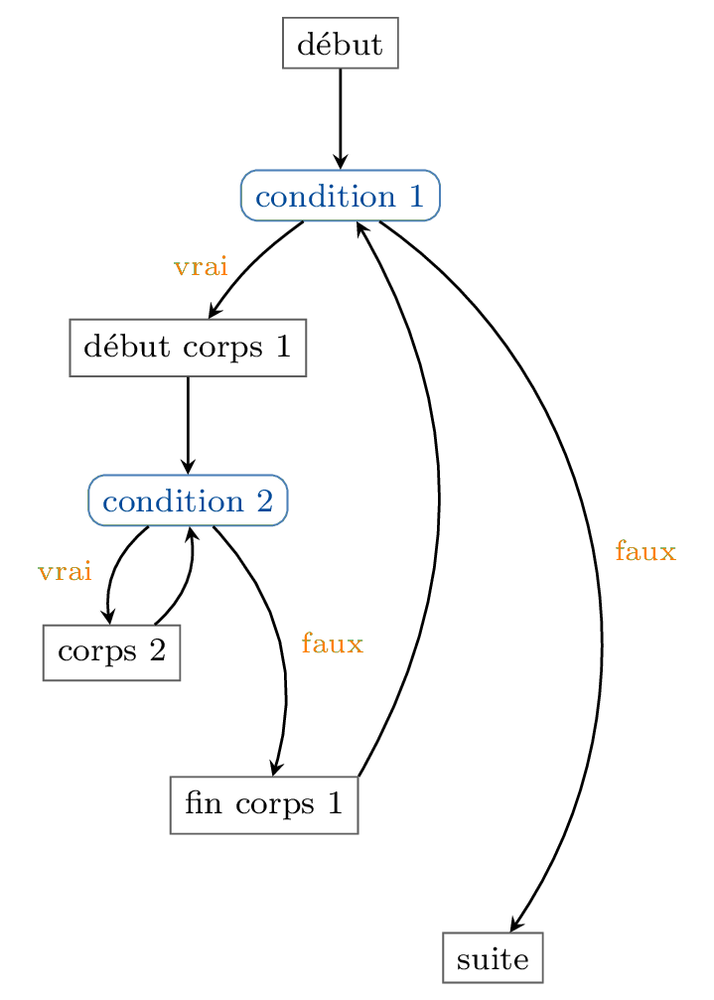
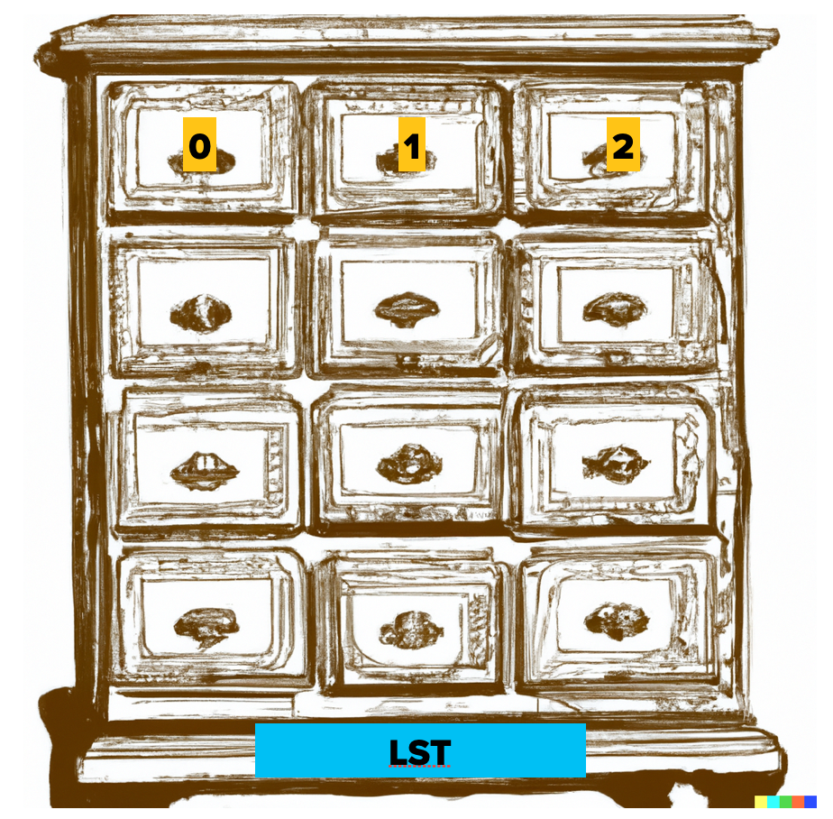
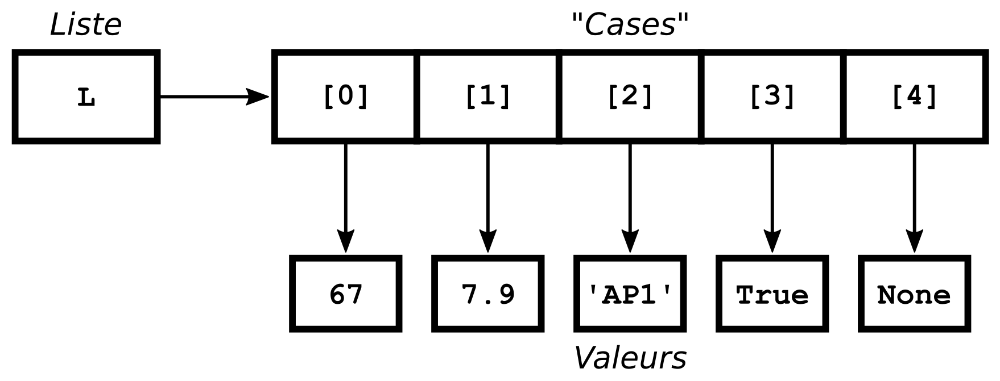

## Boucles imbriquées 

On peut écrire une boucle à l'intérieur d'une autre boucle



La syntaxe d'une double boucle `while` :
```python
# début
while condition1:
    # début corps 1
    while condition2:
        # corps 2
    # fin corps 1
# suite
```

#### Exemple : table d'addition

But : afficher toutes les additions de nombres inférieurs à `n`


```python
m = 3
n = 11

a = 0  # hors de la boucle externe !
while a < m:
    b = 0  # dans la boucle externe !
    while b < n:
        print(a, '+', b, '=', a+b)
        b += 1  # dans la boucle interne !
    a += 1  # dans la boucle externe !
```

**Exercices :** 
1. afficher toutes les additions `a + b = c` pour `a` entre 0 et `n` et `b` entre 0 et `m`
2. essayer d'écrire le programme en utilisant une seule boucle (*non recommandé en temps normal !*)

#### Exemple : compter jusqu'à 59, dix nombres par ligne 


```python
# paramètres
limite = 60
nb_colonnes = 7

courant = 0
while courant < limite:
    colonne = 0
    while colonne < nb_colonnes and courant < limite:
        print(courant, end = '\t')
        colonne += 1
        courant += 1
    print()  # affiche un retour à la ligne
```

**Exercice :** (pas si évident) faire en sorte que les nombres successifs apparaissent sur une même colonne


```python
# paramètres
limite = 37
nb_colonnes = 10

nb_lignes = limite // nb_colonnes + 1
ligne = 0
while ligne < nb_lignes:
    colonne = 0
    courant = ligne
    while courant < limite and colonne < nb_colonnes:
        print(courant, end = '\t')
        courant += nb_lignes
        colonne += 1
    ligne += 1
    print()  # affiche un retour à la ligne
```


### { width=50px } Contrôle de boucle 

Tout ce qui suit est *non exigible en contrôle*.

#### Instruction `break`

On peut sortir prématurément d’une boucle `while`
- Instruction `break` dans le corps (en général dans une conditionnelle)
- Force une sortie de boucle et passe directement à la suite du programme
- On ne réévalue pas la condition du `while`
  


**Exemple :** saisie contrôlée sans duplication de l'instruction `input` :


```python
while True:
    note_cc1 = float(input('Note du premier contrôle : '))
    if 0 <= note_cc1 <= 20:
        # saisie correcte, on termine la boucle
        break
    # saisie incorrecte, on recommence
    print('Erreur de saisie.')
```

#### Instruction `continue`

On peut passer prématurément à l’itération suivante
- Instruction `continue` dans le corps de la boucle
- On retourne directement à la condition, et on la réévalue


```python
while True:
    saisie = input("Dis-moi quelque chose : ")
    if saisie == "":
        print("Tu n'as rien dit !")
        continue
    if saisie == "je réfléchis":  # elif inutile ici !
        print("OK, j'attends...")
        continue
    if saisie == "stop":  # elif inutile ici !
        print("D'accord...")
        break
    if saisie == "arrête":  # elif inutile ici !
        print("C'est bon, j'ai compris !")
        break
    # else inutile ici !
    print("Ta phrase fait", len(saisie), "caractères.")
```

#### Remarques sur `break` et `continue`

- Ces deux instructions ne sont à utiliser que par des programmeurs confirmés
- Elles compliquent en général la compréhension et l'analyse du code
- On peut toujours s'en sortir sans (en utilisant des `if`), même si ça peut rendre le code moins "élégant"


```python
saisie = ""
while saisie != "stop" and saisie != "arrête":
    saisie = input("Dis-moi quelque chose : ")
    if saisie == "":
        print("Tu n'as rien dit !")
    elif saisie == "je réfléchis":
        print("OK, j'attends...")
    else:
        print("Ta phrase fait", len(saisie), "caractères.")
if saisie == "stop":
    print("D'accord...")
elif saisie == "arrête":
    print("C'est bon, j'ai compris !")
```


```python
a, b, c = ...

# Calcul et affichage du nombre de solutions
if a == b == c == 0:
    print("Une infinité de solutions réelles (et complexes)")
elif a == b == 0:  # A ce stade, si a = b = 0, c est différent de 0 !!!
    print("Aucune solution")
elif a == 0 :      # A ce stade, si a = 0, b est différent de 0 !!!
    print("Une solution réelle")
else:
    delta = b ** 2 - 4 * a * c
    if delta < 0:
        print("Pas de solution réelle")
    elif delta == 0:
        print("Une solution réelle")
    else:
        print("Deux solutions réelles")
```


# Introduction aux listes 

Il arrive souvent que l'on veuille faire référence à plusieurs données en même temps (parce qu'ils sont de même type, ou parce qu'elles se rapportent au même objet, par exemple). Par ailleurs, on ne sait pas toujours quelle quantité de données on va devoir retenir pour le bon déroulé de notre programme ou algorithme. 
Difficile dans ces cas de savoir le nombre exact de variables à déclarer et initialiser !
On a donc envie de pouvoir regrouper des données en les organisant en *collections ordonnées*, ayant en plus un caractère *dynamique* et *mutable* : on peut ajouter des éléments à notre collection à notre guise, en supprimer, en modifier...

En algorithmique, on parle souvent de *tableaux*, en Python, le type correspondant est **list**, et on parlera sans arrêt de *listes*.

Nous approfondirons tout cela dans la séquence de cours suivante (on verra en particulier en détail les notions de *mutabilité*, d'*itérabilité*, de boucle * for*), mais voici déjà quelques bases pour manipuler ces objets un peu spéciaux mais très utiles !
 
Pour résumer :

**Objectif :** désigner avec une seule variable une collection de valeurs

**Liste :** suite **indexée** (numérotée) d'objets quelconques (type `list` en python)

-   Élements "rangés" dans des "cases" numérotées de 0 à $n-1$

-   En mémoire : tableau à $n$ cases, chacune contenant une référence
    (*"flèche"*) vers un objet

-   Peut contenir des objets de plusieurs types différents

-   **Mutable** : peut être modifiée, agrandie, raccourcie...

<div style='float:left; margin-right:40pt; width:10cm'> *Une métaphore* </div>

<div style='float:left; margin-right:40pt; width:10cm'> *Un peu plus proche de la réalité* </div>

## Création et affichage

**Création :** suite entre `[` et `]` d'expressions séparées par `,`


```python
lst = [3, 'toto', 4.5, False, None]
print(lst)
```

Liste vide `[]` : liste ne contenant aucun objet


```python
lst = []
print(lst)
```

Une liste peut contenir d'autres listes !


```python
lst = ['test', [1, [2], 3]]
print(lst)
```

[Exemple (Python tutor)](http://pythontutor.com/visualize.html#code=%23Cr%C3%A9ation%20et%20affichage%0A%0Alst_ex1%20%3D%20%5B1,%204.5,%20'toto',%20False%5D%0A%0Alst_vide%20%3D%20%5B%5D%0A%0Alst_ex2%20%3D%20%5B1,%202,%20%5B3,'haha'%5D,%20'hoho'%5D%0A%0Aprint%28%22Le%20premier%20exemple%20%3A%20%22,lst_ex1%29%0Aprint%28%22La%20liste%20vide%20%3A%20%22,%20lst_vide%29%0Aprint%28%22Le%20deuxi%C3%A8me%20exemple%20%3A%20%22,%20lst_ex2%29%0A%0A%23Acc%C3%A8s%20%C3%A0%20un%20%C3%A9l%C3%A9ment%0Ai%20%3D%202%0Aval_ex1%20%3D%20lst_ex1%5Bi%5D%0Aval_ex2%20%3D%20lst_ex2%5Bi%5D%0Aprint%28%22Les%20%C3%A9l%C3%A9ments%20d'indice%22,%20i,%20%22sont%22,%20val_ex1,%20%22et%22,%20val_ex2%29%0A%0A%23Longueur%0Ataille_ex1%20%3D%20len%28lst_ex1%29%0Ataille_vide%20%3D%20len%28lst_vide%29%0A%0Aprint%28%22La%20longueur%20de%20lst_ex2%20est%22,%20len%28lst_ex2%29%29%0A%0A%23Modification%20d'un%20%C3%A9l%C3%A9ment%0Alst_ex1%5B0%5D%20%3D%20%22allo%3F%3F%22%0Aval_ex2%5B1%5D%20%3D%20%22blop%22%0A%0Aprint%28%22Est-ce%20que%20lst_ex2%20est%20modifi%C3%A9e%3F%5Cn%22,%20lst_ex2%29%0A%0Alst_ex2%5B2%5D%20%3D%2042%0A%0Aprint%28%22Est-ce%20que%20val_ex2%20est%20modifi%C3%A9e%3F%5Cn%22,%20val_ex2%29%0A%0A%23ajout%20d'un%20%C3%A9l%C3%A9ment%0Alst_ex1.append%28%22et%20hop%22%29%0A%23retirer%20un%20%C3%A9l%C3%A9ment%20%28case%20d'indice%202%29%0Alst_ex1.pop%282%29%0A%23%20retirer%20le%20dernier%20%C3%A9l%C3%A9ment%0Alst_ex1.pop%28%29%0A%23%20encore%20une%20fois%20sans%20perdre%20la%20valeur%20en%20route%0Ares%20%3D%20lst_ex1.pop%28%29&cumulative=false&heapPrimitives=false&mode=edit&origin=opt-frontend.js&py=3&rawInputLstJSON=%5B%5D&textReferences=false)  
(exemple filé à exploiter tout au long du cours)

## Opérations et fonctions de base

### Longueur d'une liste

La longueur d'une liste (le nombre d'éléments qu'elle contient) s'obtient par la fonction `len`.


```python
lst = [3, 'toto', 4.5, False, None]
print(len(lst))
```


```python
print(len([]))
```

### Accès aux éléments

Les éléments d'une liste à $n$ éléments sont numérotés de 0 à $n-1$.  
Le numéro d'un élément est appelé son *indice*.  
L'accès à un élément donné s'appelle l'**indexation**.


```python
lst = [3, 'toto', 4.5]
print(lst[1])
```

{ width=50px } **Attention !** 

- Le premier élément d'une liste est l'élément d'indice `0` !
- Si la liste a `n` éléments, il n'existe pas d'élément d'indice `n` !
- L'accès à un indice supérieur ou égal à la taille de la liste provoque une erreur !


```python
lst = [3, 'toto', 4.5]
print(lst[3])
```

**Exercice :** Écrire une fonction qui affiche tous les éléments d'une liste (un par ligne)


```python
def affiche_elements(lst):
    ...

lst = [3, 'toto', 4.5]
affiche_elements(lst)
```


```python
def affiche_elements(lst):
    i = 0
    while i < len(lst):
        print(lst[i])
        i = i + 1


lst = [3, 'toto', 4.5]
affiche_elements(lst)
```

### Modification d'un élément

On peut modifier le $i$-ème élément de `lst` à l'aide d'une affectation :


```python
lst = [3, 'toto', 4.5, False, None]
print(lst[2])
lst[2] = 'titi'
print(lst)
```

**Attention**, ceci ne crée pas une nouvelle liste mais modifie la
liste sur place !


```python
lst = [3, 'toto', 4.5, False, None]
lst_bis = lst
lst[2] = 'titi'
lst_bis
```

### Concaténation et répétition

Comme pour les chaînes de caractères (`str`) on peut utiliser les opérateurs `+` pour fabriquer la concaténation de deux listes et `*` pour répéter une liste.


```python
[3, 'toto', 4.5] + [False, None]
```


```python
[] + [3, 'toto', 4.5] + []
```


```python
3 * ['a', 'b']
```


```python
[0] * 13
```

On peut utiliser ces opérateurs pour recopier une liste. Comparer :


```python
lst = [3, 'toto', 4.5]
lst2 = lst
lst3 = lst + []
lst4 = lst * 1
```

### Test d'appartenance

**Exercice :** Écrire une fonction recevant une liste et une valeur, et
renvoyant `True` si la valeur apparaît dans la liste (`False` sinon)


```python
def appartient(lst, val):
    ...
```


```python
def appartient(lst, val):
    i = 0
    while i < len(lst):
        if lst[i] == val:
            return True
        i += 1
    return False

lst = ['Hildegarde', 'Cunégonde', 'Médor']

print(appartient(lst, 'Cunégonde'))

if appartient(lst, 'Médor'):
    print('Bon chien !')
```


**Remarque :** Cette fonctionnalité existe déjà en Python :

-   `val in lst` vaut `True` si `val` apparaît dans `lst`, `False` sinon
-   Réciproquement, on peut écrire `val not in lst`


```python
lst = ['Hildegarde', 'Cunégonde', 'Médor']
'Cunégonde' in lst
```


```python
lst = ['Hildegarde', 'Cunégonde', 'Médor']
'Rex' not in lst
```


```python
lst = ['Hildegarde', 'Cunégonde', 'Médor']
if 'Médor' in lst:
    print('Bon chien !')
```

## Manipulations par méthodes

On va maintenant énumérer un certain nombre de méthodes prédéfinies sur les listes, permettant des modifications plus complexes. Pour plus de détails, on pourra consulter la [documentation en ligne](https://docs.python.org/3/).

### Agrandir ou rétrécir une liste

Plusieurs instructions ont un effet sur la taille de la liste :

-   L'instruction `lst.append(elem)` ajoute l'élément `elem` à la fin de
    la liste `lst`

-   L'instruction `lst.pop()` supprime le dernier élément de `lst` et
    renvoie sa valeur

-   L'instruction `lst.pop(i)` supprime l'élément d'indice `i` de `lst` et
    renvoie sa valeur

*Les fonctions `append` et `pop` sont appelées **méthodes**, ou fonctions
s'appliquant à un objet (nous en verrons d'autres dans les cours
suivants)*

**Attention**, ces instructions ne créent pas une nouvelle liste mais
modifient la liste sur place !

**Attention**, ne pas confondre `x = lst[2]` et `x = lst.pop(2)` !


```python
lst = [3, 'toto', 4.5, False, None]
lst_bis = lst

lst.append(1)
print(lst_bis)

elem = lst_bis.pop(2)
print(elem)

print(lst)
```


# Introduction aux fonctions 


En programmation, une fonction est :
- un morceau de programme
- portant en général un **nom**
- acceptant zéro, un ou plusieurs **paramètres**
- produisant le plus souvent un **résultat**. 

Des exceptions existent, mais la forme la plus courante d'une fonction est donc proche de celle d'une fonction mathématique.

L'utilisation de fonctions améliore les aspects suivants du code :

-  **Lisibilité :** 
    - isoler une partie du programme (par exemple un gros calcul compliqué)
    - éviter une trop grande imbrication des `if`, des `while`
-  **Modularité et robustesse:** 
    - réutiliser le même code plusieurs fois (évite de recopier le code)
    - faciliter la correction des bugs, l'évolution et la maintenance
-  **Généricité :**
    - changer la valeur des paramètres (même calcul mais avec différentes valeurs de départ)

## Fonctions prédéfinies et bibliothèque standard

En Python, il existe un grand nombre de fonctions prédéfinies, que nous avons déjà utilisées, par exemple :

* `int(obj)` : 1 paramètre, 1 résultat. Reçoit en paramètre un objet (par exemple `str` ou `float`), essaie de le transformer en entier et renvoie l'entier obtenu.


```python
int("34")
```

* `len(obj)` : 1 paramètre, 1 résultat. Reçoit un objet (par exemple `str`) et renvoie sa longueur.


```python
len("bonjour")
```

* `randint(mini, maxi)` : 2 paramètres, 1 résultat. Reçoit deux nombres, et renvoie un entier aléatoire compris entre ces deux nombres (inclus).


```python
from random import randint
randint(1, 34)
```

Il y en a beaucoup d'autres, comme `print, input, float, str...`.

Ces fonctions sont appelées _prédéfinies_ (ou _built-in_)
- il est inutile de les connaître toutes par cœur
- liste des fonctions prédéfinies sur [cette page](https://docs.python.org/3/library/functions.html)

Il existe également de nombreux _modules_ officiels (par exemple le module `random`)
- bibliothèques de fonctions, de types et d'objets
- liste des modules prédéfinis documentée [ici](https://docs.python.org/3/library).

## Définition de fonction

Pour définir une nouvelle fonction on utilise la syntaxe suivante :

```python
# ligne suivante : en-tête de fonction
def nom_fonction(param_1, ..., param_n):  
    # corps de la fonction
    # utilisant param_1 à param_n
    ...
    # peut renvoyer un résultat :
    return resultat
```

Une fonction peut :

* prendre un certain nombre de paramètres (ici, $n$, qui s'appellent `param_1` à `param_n`)
* renvoyer une valeur (via l’instruction `return`)

## Appel de fonction

Une fois définie, `nom_fonction` peut être utilisée dans le code (on parle d'un **appel**) en indiquant entre parenthèses ses paramètres séparés par des virgules :

```python
# définition de fonction
def nom_fonction(param_1, ..., param_n): 
    ...

# reste du programme 
...
# appel de la fonction :
une_var = nom_fonction(expr_1, ..., expr_n)
```

### Exemples

#### Fonction à paramètres et résultat


```python
# fonction à deux paramètres produisant un résultat
def maximum(a, b):
    if a >= b:
        return a
    else:
        return b
```


```python
nb1 = 14
nb2 = 31

maximum(nb1, nb2)  # ne sert à rien !!

# On appelle la fonction et on garde le résultat dans c :
c = maximum(nb1, nb2)
print("le max de", nb1, "et", nb2, "est", c)

# On peut aussi utiliser directement le résultat :
print("le max de", nb1, "et", nb2, "est", maximum(nb1, nb2))
```

**Entraînement :** 

- Décrire l'exécution pas à pas du programme (avec état de la mémoire). On peut aussi essayer avec [Python Tutor](http://www.pythontutor.com/visualize.html#code=%23%20fonction%20%C3%A0%20deux%20param%C3%A8tres,%20sans%20effet%20de%20bord%0Adef%20maximum%28a,%20b%29%3A%0A%20%20%20%20if%20a%20%3E%20b%3A%0A%20%20%20%20%20%20%20%20return%20a%0A%20%20%20%20else%3A%0A%20%20%20%20%20%20%20%20return%20b%0A%20%20%20%20%0Anb1%20%3D%20int%28input%28%29%29%0Anb2%20%3D%20int%28input%28%29%29%0A%0A%23%20On%20appelle%20la%20fonction%20et%20on%20garde%20le%20r%C3%A9sultat%20dans%20c%20%3A%0Ac%20%3D%20maximum%28nb1,%20nb2%29%0Aprint%28%22le%20max%20de%22,%20nb1,%20%22et%22,%20nb2,%20%22est%22,%20c%29%0A%0A%23%20On%20peut%20aussi%20utiliser%20directement%20le%20r%C3%A9sultat%20%3A%0Aprint%28%22le%20max%20de%22,%20nb1,%20%22et%22,%20nb2,%20%22est%22,%20maximum%28nb1,%20nb2%29%29&cumulative=false&curInstr=0&heapPrimitives=true&mode=display&origin=opt-frontend.js&py=3&rawInputLstJSON=%5B%5D&textReferences=false).
- Dresser un tableau de valeurs de l'exécution du programme

### Fonction sans paramètre

- En principe, une fonction sans paramètre devrait avoir toujours le même comportement
- Dans l'exemple suivant, on utilise un générateur pseudo-aléatoire, ce qui explique que la fonction ne renvoie pas toujours le même résultat
- Une fonction pourrait aussi recevoir des données depuis l'extérieur (utilisateur, requête réseau...).

Dans ces cas, on parle de **causes secondaires**


```python
from random import randint

def lance_de() :
    return randint(1,6)

compteur = 1
while lance_de() != 6: 
    compteur = compteur + 1
print('Obtenu un 6 en', compteur, 'jets de dé.')
```

### Fonction sans valeur de retour

- Si l'exécution arrive à la dernière instruction du corps de la fonction sans rencontrer d'instruction `return expr`, alors la valeur de retour par défaut est `None` (même comportement si `return` seul)
- En général une telle fonction a quand même un effet sur l'environnement (affichages, dessin, écriture dans un fichier, envoi d'informations sur le réseau...)

Pour tous les effets autres que le renvoi d'un résultat, on parle d'**effets secondaires**


```python
from turtle import *

def trace_polygone(nb_cotes, taille_cote):
    down()
    i = 0
    while i < nb_cotes:
        forward(taille_cote)
        left(360 / nb_cotes)
        i = i + 1

# faire une affectation ici ne servirait à rien (essayer !)
trace_polygone(5, 100)
exitonclick()
```

### Erreur fréquente : confusion (paramètre / saisie) et (retour / affichage)

Les programmeurs débutants confondent très souvent la notion de paramètre et celle de saisie (au clavier par exemple) et la notion de valeur de retour avec celle de valeur affichée. 


```python
# ATTENTION CECI EST INCORRECT, A NE PAS REPRODUIRE !!!
def pgcd(a, b):
    a = int(input())  # NON !
    b = int(input())  # NON !
    while a % b != 0:
        r = a % b
        a = b
        b = r
    print("le pgcd est", b)  # NON !
```

<div style='color:red'>NE SURTOUT PAS PROGRAMMER COMME ÇA !</div>

- Comment écrire un programme vérifiant si trois entiers sont
  premiers entre eux à l'aide de cette fonction ?
- Combien ce programme ferait-il de saisies ?
- Qu'afficherait ce programme ?


