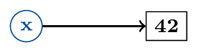

## Approfondissements sur les fonctions

Avant de lire cette section, relisez attentivement la section "Introduction aux fonctions" des notes de cours de la Séquence 1 !

### Exemples

Calculer le *maximum* de deux entiers :
```python
def maximum_int(a, b):
    if a > b:
        return a
    else:
        return b
```

Calculer le *maximum* d'une liste non-vide :
```python
def maximum_liste(lst):
    m = lst[0] # /!\ Erreur si lst est vide
    for elt in lst:
        if elt > m:
        m = elt
    return m
```

### Fonctions et espaces de noms

Points de vigilance :

- les paramètres et variables définies dans le corps d'une fonction sont indépendantes des autres variables du programme
- elles n'existent plus une fois l'exécution de la fonction terminée
- on les appelle des variables *locales*

En particulier, modifier les valeurs des variables locales ne modifie pas les variables globales. Par exemple :
```python
def maximum(a, b):
    if a > b:
        b = a
    return b

nb1 = 13
nb2 = 3
c = maximum_1(nb1, nb2)
print("le max de", nb1, "et", nb2, "est", c)
# Affiche "le max de 13 et 3 est 13"
# nb2 n'a pas changé et vaut toujours 3,
# malgré l'instruction "b = a"
```
Et cela, même si les variables locales ont le même nom que les variables globales :
```python
def maximum(a, b):
    if a > b:
        b = a
    return b

a = 13
b = 3
c = maximum(a, b)
print("le max de", a, "et", b, "est", c)
# Affiche "le max de 13 et 3 est 13"
# Les valeurs de a et b n'ont pas changé
```

*NB :* Pour des raisons de lisibilité, on évite néanmoins de donner le même nom à des variables locales et des variables locales.

**Entraînement :** Décrire l'exécution pas à pas du programme (avec état de la mémoire).

**À retenir :** Changer les valeurs de `a` et `b` dans la fonction n'a pas d'effet sur `a` et `b` dans le programme principal !


Par ailleurs, modifier les noms des variables locales ne change pas le comportement de la fonction :
```python
def maximum_1(a, b):
    if a > b:
        b = a
    return b

def maximum_2(x, y):
    if x > y:
        y = x
    return y

nb1 = 13
nb2 = 3
c = maximum_1(nb1, nb2)
print("le max de", nb1, "et", nb2, "est", c)
d = maximum_2(nb1, nb2)
print(c == d)
# Affiche True
```

**Entraînement :** Décrire l'exécution pas à pas du programme (avec état de la mémoire).

**À retenir :** Changer les noms de `a` et `b` dans la fonction n'a pas d'effet sur son comportement !

#### Autre exemple important

Essayons d'écrire une fonction permettant d'intervertir les valeurs de deux variables :

```python
def echange(a, b):
    temp = a
    a = b
    b = temp

x = 1
y = 2
echange(x, y)
print(x, y)
print(temp)
# les valeurs de x et y n'ont pas changé non plus
```

**Entraînement :** Décrire l'exécution pas à pas du programme (avec état de la mémoire).

**À retenir :**

- changer les valeurs de `a` et `b` dans la fonction n'a pas d'effet sur `x` et `y` dans le programme principal !
- la variable `temp` n'existe plus après l'exécution de la fonction

### Composition de fonctions

En maths, on peut composer des fonctions :
$$\forall x \in X, g \circ f(x) = g(f(x))$$

En informatique, on peut appeler une fonction dans une fonction ! (et ainsi de suite)

Reprenons l'exemple du calcul du minimum d'une liste :

```python
def maximum_liste(lst):
    m = lst[0] # /!\ Erreur si lst est vide
    for elt in lst:
        if elt > m:
        m = elt
    return m
```

Nous avions aussi défini :
```python
def maximum_int(a, b):
    if a < b:
        return a
    else:
        return b
```
On peut alors réécrire `maximum_liste` :
```python
def maximum_liste(lst):
    m = lst[0] # /!\ Erreur si lst est vide
    for elt in lst:
        m = maximum_int(m, elt)
    return m
```

Un autre exemple, si on veut manipuler des fractions :
```python
def pgcd(a, b):
    while a % b != 0:
        r = a % b
        a = b
        b = r
    return b
```


```python
def simplifier(num, denom):
    d = pgcd(num, denom)
    return (num // d, denom // d)
```


```pycon
>>> simplifier(8, 6)
(4, 3)
```


```pcon
>>> simplifier(21, 39)
(7, 13)
```

Un dernier exemple :
```python
def pgcd3(a, b, c):
    d = pgcd(a, b)
    return pgcd(c, d)
```


```pycon
>>> pgcd3(18, 27, 12)
3
```


```pycon
>>> pgcd3(12, 10, 15)
1
```

### Sémantique d'un appel

Au moment d'un appel de fonction, un espace de noms local est créé. Il associe à chacun des paramètres la valeur de l'expression correspondante dans l'appel. Les variables locales sont également créées dans ces espaces de noms.

#### Espace de noms

Un **espace de noms** est un ensemble de noms (de variables, de fonctions...) défini à un certain point d'un programme

L'ensemble de tous les noms connus à un point du programme est généralement constitué de plusieurs espaces de noms superposés (du plus ancien au plus récent) :

- espace de noms prédéfini (*built-in*)
- espace de noms global
    - noms définis dans le programme principal
- empilement des espaces de noms locaux des appels de fonction en cours
    - dans l'ordre chronologique
    - contenant chacun les paramètres de l'appel correspondant
    - contenant chacun les variables locales à cette fonction

#### Pile d'appels

L'empilement des espaces de noms obéit à une politique de **pile**

- sommet : appel en cours
- en-dessous : appels précédents
- *(presque)* tout en bas : espace de nom global

Dans Python Tutor : le plus récent est en bas...

Quand l'appel en cours se termine

- son espace de nom est supprimé de la pile
- l'exécution de l'appel précédent reprend

Quand un nouvel appel commence :

- l'exécution de la fonction en cours s'interrompt
- un nouvel espace de noms local est créé
- l'exécution de la fonction appelée commence

Quand une erreur se produit pendant l'exécution d'un appel :

- la ligne en cours de chaque appel est affiché (du plus ancien au plus récent)
- nom technique : « traceback »


```pycon
>>> simplifier(4, 0)
Traceback (most recent call last):
  File "<stdin>", line 1, in <module>
  File "<string>", line 9, in simplifier
  File "<string>", line 2, in pgcd
ZeroDivisionError: integer division or modulo by zero
```

#### Portée des variables

Accès à la valeur d'une variable :

- possible pour n'importe quel nom défini dans un des espaces de noms antérieurs
- si plusieurs espaces contiennent le même nom, c'est le plus récent qui est sélectionné
- la plupart du temps, on n’a besoin que des variables locales (quitte à ajouter des paramètres)

Affectation :

- par défaut, uniquement aux variables locales
- (pas au programme) pour une variable dans un espace de nom plus ancien, mots-clés `global` ou `nonlocal` (à utiliser avec précaution, c'est très rarement la bonne chose à faire)

#### Déroulement détaillé d'un appel

Considérons l'appel suivant :

```python
def ma_fonction(p_1, ..., p_n):
    ...
    return expr

# Appel de fonction (à l'intérieur d'une expression)
... ma_fonction(e_1, ..., e_n) ...
```

Succession des étapes de l'appel :

- création d'un espace de noms local contenant `p_1` à `p_n` au sommet de la pile d'appels
- chaque expression `e_i` est évaluée en une valeur `v_i` et affectée à la variable `p_i`
- exécution du corps de la fonction dans l'espace de noms local
- si la fonction exécute l'instruction `return expr` ou atteint la fin de son bloc d'instructions
    - l'espace de noms local est détruit
    - l'expression appelante `ma_fonction(e_1, ..., e_n)` prend la valeur de `expr` (respectivement `None`)
- reprise du programme principal dans l'espace global

Vocabulaire :

- les noms `p_1` à `p_n` sont appelés _paramètres formels_ (ou _paramètres_ tout court)
- les valeurs `v_1` à `v_n` sont appelées _paramètres effectifs_ (ou _arguments_)

#### Exemple

Pour bien comprendre l'ordre des appels et les variables locales, exécutez le code suivant sur PythonTutor ou Thonny (fichier `appels_imbriques.py`) :
```python
def f(phrase):
    phrase = phrase + "petite "
    return g(h(phrase))

def g(phrase):
    phrase = phrase + "brise "
    return h(phrase)

def h(phrase):
    if phrase[0] == "L":
        phrase = phrase + "la "
        return k(phrase)
    else:
        return "La " + phrase

def k(phrase):
    return phrase + "glace."

phrase_test = ""
phrase_test = f(phrase_test)
print(phrase_test)
```


### Documentation et test de fonctions

En pratique, votre code sera souvent lu par d'autres personnes :

- vos collaborateurs/trices (et dès cette année, vos partenaires de Projet 1 et Projet 2)
- vous-mêmes dans plusieurs mois ou plusieurs années

Par conséquent, il ne suffit pas que votre code fonctionne. Il faut aussi qu'il soit compréhensible ! Pour cela, il faut :

- choisir des noms de variables compréhensibles (pas `x` ou `y`)
- lorsque ce n'est pas évident, expliquer ce que votre code fait

Comme les fonctions jouent un rôle central en Python, ce dernier a un système dédié pour expliquer (on dit aussi *documenter*) ce que fait une fonction : les `docstrings`.

#### Chaînes de documentation (*docstring*)

Bonne pratique : indiquer par un commentaire

- à quoi sert une fonction
- ce que représentent ses paramètres et leur type
- ce que représente sa valeur de retour
- d'éventuels effets ou causes secondaires


```python
def triple(n):
    """
    Fonction calculant le triple du nombre n (int ou float)
    ou la répétition trois fois de la chaîne n.
    """
    return n * 3
```

On peut accéder à la chaîne de documentation d'une fonction en tapant `help(nom de la fonction)` dans l'interpréteur :


```pycon
>>> help(triple)
Help on function triple in module __main__:

triple(n)
    Fonction calculant le triple du nombre n (int ou float)
    ou la répétition trois fois de la chaîne n.
```

Cela fonctionne aussi pour les fonctions prédéfinies ou issues de modules :

```pycon
from random import randint
>>> help(randint)
Help on method randint in module random:

randint(a, b) method of random.Random instance
    Return random integer in range [a, b], including both end points.
```

*NB :* la documentation est souvent rédigée en anglais.

#### Tests intégrés à la documentation (*doctest*)

Comme tout morceau de programme, chaque fonction doit être *testée* immédiatement pour s'assurer qu'elle fonctionne.


```pycon
>>> triple(3)
9
```


```pycon
triple(9.0)
27.0
```

Plutôt que de perdre ces tests, il est utile de les intégrer à la documentation de la fonction, pour pouvoir s'y référer plus tard. Si l'on change le code de la fonction, cela permet aussi de vérifier que son comportement reste correct.


```python
def triple(n):
    """
    Fonction calculant le triple du nombre n (int ou float)
    ou la répétition trois fois de la chaîne n.

    >>> triple(3)
    9
    >>> triple(9.0)
    27.0
    """
    return n * 3
```

Il existe des outils qui permettent de lancer automatiquement tous les tests présents dans la documentation, et de vérifier qu'ils produisent les résultats annoncés.

Par exemple, à la fin d'un programme, on peut écrire le code suivant pour lancer systématiquement tous les tests présents dans le fichier :

```python
import doctest
doctest.testmod()
```

Exemple :


```python
def triple(n):
    """
    Fonction calculant le triple du nombre n (int ou float)
    ou la répétition trois fois de la chaîne n.

    >>> triple(3)
    9
    >>> triple(9.0)
    27.0
    >>> triple('pom')
    'pompompom'
    """
    return n * 3
```


```python
def racine(n):
    """
    Fonction calculant la racine carrée du nombre n.

    >>> racine(0)
    0.0
    >>> racine(1)
    1.0
    >>> racine(4)
    2.0
    """
    return n ** (1/2)
```


```pycon
import doctest
>>> doctest.testmod()
TestResults(failed=0, attempted=6)
```

Supposons que l'on se soit trompé en implémentant une fonction. Par exemple :
```python
def tous_pairs(liste):
    """
Vérifie que tous les entiers contenus dans la liste sont pairs.

>>> tous_pairs([2, 4, 2, 0])
True
>>> tous_pairs([2, 4, 2, 1])
False
>>> tous_pairs([])
True
>>> tous_pairs([1, 2, 5])
False
"""
    for elt in liste:
        if elt % 2 != 0:
            return False
        else:
            return True # Oups !
            # Le "return True" doit être à la fin de la boucle,
            # pas à l'intérieur
```

```pycon
import doctest
>>> doctest.testmod()
**********************************************************************
File "__main__", line 50, in __main__.tous_pairs
Failed example:
    tous_pairs([2, 4, 2, 1])
Expected:
    False
Got:
    True
**********************************************************************
File "__main__", line 52, in __main__.tous_pairs
Failed example:
    tous_pairs([])
Expected:
    True
Got nothing
**********************************************************************
1 items had failures:
   2 of   4 in __main__.tous_pairs
***Test Failed*** 2 failures.
TestResults(failed=2, attempted=4)
```
Python fait les tests pour nous, et nous indique lesquels ont échoué.


#### (non exigible) Annotations de type

**Attention :** La notion d'annotations de type est hors programme, et *non exigible en contrôle*.

On peut également préciser le type des paramètres et du résultat d'une fonction à l'aide d'annotations de type

- Ces annotations ne sont pas vérifiées directement par Python
- Elles sont utilisées par certains environnements de développement (IDE) comme PyCharm, VSCode, etc. pour fournir de l'information à l'utilisateur.ice
- Voir la documentation [ici par exemple](https://docs.python.org/fr/3/library/typing.html)


```python
def pgcd(a: int, b: int) -> int:
    while a % b != 0:
        r = a % b
        a = b
        b = r
    return b
```


```python
def salutation(nom: str) -> str:
    return 'Bonjour ' + nom
```

## Listes

Avant de lire cette section, relisez attentivement la section "Listes" des notes de cours de la Séquence 1 !

### Parcours de listes (`for`, `while`)

Il existe plusieurs constructions pour parcourir les listes. Le choix dépend de ce qu'on veut en faire. Dans cette section, nous allons voir comment chacune permet d'afficher les éléments d'une liste.

#### Les boucles `for`

##### `for elem in liste`

Les listes sont des *itérables*, c'est-à-dire que l'on peut les parcourir élément par élément. La construction la plus utilisée est ainsi la boucle `for elem in liste:`. Dans cette boucle, la variable `elem` prend tour à tour pour valeur chaque élément de la liste. Par exemple :
```python
liste = [5, 1, 3, 8]
for elem in liste:
    print(elem)
```
Affiche à l'écran :
```
5
1
3
8
```

*NB :* ici, on a choisi d'appeler la variable `elem`, mais vous pouvez lui donner n'importe quel nom. Par exemple, le code suivant produira le même résultat :
```python
liste = [5, 1, 3, 8]
for toto in liste:
    print(toto)
```

##### `for i in range(len(liste))`

Comme on l'a déjà vu, on peut accéder aux éléments d'une liste par leur indice (attention, pour rappel, en informatique, les indices commencent à 0 et non 1). Par exemple :
```pycon
liste = [5, 1, 3, 8]
>>> liste[2]
3
```
On peut donc parcourir une liste via ses indices : on fait parcourir à une variable `i` l'intervalle (*range* en anglais) allant de 0 (inclus) à `len(liste)` (exclu, car le dernier élément a pour indice `len(liste) - 1`). On accède ensuite au $i$-ème élément via `liste[i]`. Ça s'écrit comme suit :
```python
liste = [5, 1, 3, 8]
for i in range(len(liste)):
    print(liste[i])
```
Affiche à l'écran :
```
5
1
3
8
```
On pourrait donc aussi afficher les indices au passage :
```python
liste = [5, 1, 3, 8]
for i in range(len(liste)):
    print(i, liste[i])
```
Affiche à l'écran :
```
0 5
1 1
2 3
3 8
```

*NB :* ici aussi, vous pouvez donner à `i` un autre nom.

##### (non exigible) `for i, elem in enumerate(liste)`

Cette dernière boucle n'est *pas exigible au contrôle*.

Parfois, on a besoin d'avoir accès à la fois à l'indice et à l'élément. La boucle `for i, elem in enumerate(liste)` permet cela ! Pour reprendre l'exemple précédent :
```python
liste = [5, 1, 3, 8]
for i, elem in enumerate(liste):
    print(i, elem)
```
Affiche à l'écran :
```
0 5
1 1
2 3
3 8
```
C'est comme si à chaque tour de boucle, on écrivait `elem = liste[i]`.

#### `while`

C'est la construction qu'on a vue en première approche sur les listes. Cependant, c'est aussi la moins courante, et on ne l'utilise que quand ce que l'on fait est susceptible de modifier la liste. Pour être complet, montrons toutefois comment afficher une liste avec une boucle `while` :
```python
liste = [5, 1, 3, 8]
i = 0
while i < len(liste):
    print(liste[i])
```
Affiche à l'écran :
```
5
1
3
8
```

On verra dans la section ["Les fonctions classiques sur les listes"](#fonctions_classiques) des exemples où c'est pertinent d'utiliser une boucle `while`.

#### Quand utiliser tel ou tel type de boucle ?

En règle générale, même s'il y a bien sûr des exceptions :

- quand on n'a besoin d'accéder qu'aux éléments sans les modifier, on utilise une boucle `for elem in liste`
- quand on a besoin d'accéder aussi aux indices, et qu'on veut éventuellement modifier les éléments sans en supprimer ni en ajouter, on utilise une boucle `for i in range(len(liste))`
- quand a besoin des indices et des éléments, on *peut* utiliser une boucle `for i, elem in enumerate(liste)`
- quand on veut ajouter et/ou supprimer des éléments de la liste, on utilise une boucle `while`.

Pour des exemples, voir le fichier `types_boucles.py`.

Le reste de cette section n'est pas exigible au contrôle. Si vous le souhaitez, vous pouvez aller directement à la section ["Les listes de listes"](#listes_listes).

##  (non exigible) Manipulation de sous-listes : les *slices* (tranches)

La connaissance de cette notion *n'est pas exigible à l'examen*.

### Accès à une slice

-   Syntaxe : `lst[i, j]` construit une liste contenant les éléments
    d'indices `i` à `j-1` de `lst`
-   Attention, l'élément d'indice `i` est **inclus** mais celui d'indice
    `j` est **exclu** !


```python
lst = [3, 'toto', 4.5]
print(lst[1:len(lst)])
print(lst[0:1])
```

-   Si `i` est omis, il prend la valeur par défaut `0`
-   Si `j` est omis, il prend la valeur par défaut `len(lst)`


```python
lst = [3, 'toto', 4.5]
print(lst[:len(lst)-1])
print(lst[:])  # cette instruction crée une copie de lst !
```

### Affectation de slice

On peut aussi utiliser la syntaxe des tranches pour modifier en une seule fois une partie de la liste


```python
lst = [3, 'toto', 4.5]
lst[1:3] = ["riri", "fifi", "loulou"]
print(lst)
```

### Tranches avec intervalle

Il est possible de compléter la notation des tranches en spécifiant un "pas" `k`: `lst[i:j:k]`. Dans ce cas, on sélectionne uniquement les éléments d'indices `i`, `i+k`, `i+2*k`, etc. en s'arrêtant à l'indice `j`(exclu).


```python
lst = [0, 1, 2, 3, 4, 5]
print(lst[1:6:2])
```

Un exemple un peu étrange :


```python
lst = [0, 1, 2, 3, 4, 5]
print(lst[6:1:-1])
```

##  (non exigible) Indices négatifs

La connaissance de cette notion *n'est pas exigible à l'examen*.

Il est possible d'utiliser des indices négatifs pour accéder aux éléments d'une liste. Dans ce cas, les éléments sont numérotés à partir de la droite, en commençant par l'indice `-1` et jusqu'à l'indice `-len(lst)` :


```python
lst = [3, 'toto', 4.5]
print(lst[-1])
print(lst[-3])
```

On voit que `lst[-1]` est une autre façon de désigner l'élément `lst[len(lst)-1`, et `lst[-len(lst)]` désigne `lst[0]`. Tenter d'accéder à un indice plus petit provoque une erreur :


```python
lst = [3, 'toto', 4.5]
print(lst[-4])
```

Ces indices négatifs sont utiles comme raccourcis d'écriture dans certains cas particuliers, par exemple pour construire la copie d'une liste privée de son dernier élément :


```python
lst = [3, 'toto', 4.5]
print(lst[:-1])
```

##  (non exigible) Un autre type de parcours de liste : `enumerate`


*La connaissance de cette notion n'est pas exigible à l'examen.*

La fonction `enumerate(iterable)` permet d'itérer sur les couples `(i, elem)` constitués d'un indice et de l'élément correspondant dans `iterable`.


```python
def chercher(L, x):
    for i, elem in enumerate(L):
        if elem == x:
            return i
    return None
```


```python
def lister(lst):
    for i, elem in enumerate(lst):
        print(i, '->', elem)

lister([6, 3, 8])
```

##  (non exigible) Comprehénsions de listes


*La connaissance de cette notion n'est pas exigible à l'examen.*

Il existe une syntaxe abrégée, inspirée de la notation ensembliste des mathématiques, qui permet de définir rapidement des listes. On parle souvent de "compréhensions de listes", tiré du terme anglais *list comprehensions*, même s'il serait plus correct de parler de "listes en compréhension" ou de "mutations de listes".

La syntaxe est :

```
lst = [<forme d'un élement> for <variable> in <iterable>]
```

Cette écriture est équivalente à la syntaxe habituelle suivante :

```
lst = []
for <variable> in <iterable>:
    lst.append(<forme d'un element>)
```

On peut aussi rajouter une condition :

```
lst = [<forme d'un élement> for <variable> in <iterable> if <condition>]
```

Ce qui équivaut à :

```
lst = []
for <variable> in <iterable>:
    if <condition>:
        lst.append(<forme d'un element>)
```

Voici quelques exemples :


```python
[i*i for i in range(10)]  # liste des 10 premiers carrés
```


    [0, 1, 4, 9, 16, 25, 36, 49, 64, 81]


```python
lst = []
for i in range(10):
    lst.append(i*i)
lst
```


    [0, 1, 4, 9, 16, 25, 36, 49, 64, 81]


```python
[i*i for i in range(10) if i*i % 2 == 0]
```


```python
[c for c in 'anticonstitutionnellement' if c in 'aeiouy']  # liste des voyelles d'un mot
```

On peut aussi utiliser plusieurs boucles et conditions :

```
lst = [<forme d'un élement>
       for <variable1> in <iterable1>
       for <variable2> in <iterable2>
       if <condition>]
```

Ce qui équivaut à :

```
lst = []
for <variable1> in <iterable1>:
    for <variable2> in <iterable2>:
        if <condition>:
            lst.append(<forme d'un element>)
```

Exemple :


```python
[(x, y) for x in [1,2,3] for y in [3,1,4] if x != y]
```

On peut également imbriquer les expressions de ce type :


```python
[[i + j for j in range(5)] for i in range(5)]
```

## Listes de listes {#listes_listes}

Une liste peut contenir des éléments de n'importe quel type, et donc en particulier des listes, voire des listes de listes, etc.

### Exemple : le morpion

Les listes de listes sont particulièrement adaptées lorsque l'on souhaite représenter des grilles carrées ou rectangulaires. C'est le cas du morpion, qui se joue sur une grille 3x3 (voir aussi l'exercice "retournement"). Par exemple, la grille (les points représentent des cases vides) :
 . . .
 X . X
 . O .
Peut être représentée par la liste de liste :


```python
grille = [['.', '.', '.'], ['X', '.', 'X'], ['.', 'O', '.']]
```

La case de coordonnées `(i, j)` correspond alors à `grille[i][j]` (attention : comme d'habitude, la numérotation commence à 0). Graphiquement :
   0 1 2
 0 . . .
 1 X . X
 2 . O .
On peut expérimenter :


```python
grille[2][1] # Vous pouvez faire varier les indices
```

On peut aussi modifier le contenu des cases :


```python
grille[2][2] = 'O'
grille
```

Voir le fichier `morpion_complet.py` pour un exemple complet.

### Copie superficielle

Pour des raisons d'efficacité, Python est flemmard : lorsqu'on met une liste dans une variable, la liste n'est pas copiée, et la variable est simplement un *alias*.


```python
liste = [1, 2, 3]
fausse_copie = liste
fausse_copie[1] = 4
print(fausse_copie)
print(liste)
# fausse_copie et liste sont toutes deux modifiées !
```

C'est très instructif d'aller voir ce qu'il se passe mémoire sur PythonTutor : `fausse_copie` et `liste` pointent vers la *même* liste.

Cela vaut aussi pour les listes de listes ! Par exemple :


```python
ligne = [1, 2, 3]
grille = []
for i in range(3):
    grille.append(ligne)
# Équivalent à grille = [ligne] * 3
grille[2][1] = 4
print(grille)
# Le contenu des trois lignes est modifié, puisque c'est la *même* liste
```

## Fonctions qui modifient des listes

### Retour sur le modèle de mémoire

Pour bien comprendre cette section, il est utile de revoir la section "Modèle de mémoire de Python" de la séquence 1 du cours. Ainsi, chaque variable est en fait le nom d'une flèche vers un objet en mémoire :
.

Souvenez-vous de cet exemple :


```python
def essaie_de_modifier_pour_voir(x):
    x = 5

x = 12
essaie_de_modifier_pour_voir(x)
print(x)
```

La valeur de x **n'est pas modifiée** ! En effet, la fonction reçoit seulement la *valeur* de `x`, qui est `12`, et le `x` dans la fonction est cantonné à l'espace de noms local (ce n'est pas le même `x`).

Plus généralement, une fonction ne peut pas faire en sorte qu'une variable pointe vers *un autre* objet en mémoire :


```python
def essaie_de_modifier_pour_voir_2(x):
    x = [5]

x = [12]
essaie_de_modifier_pour_voir_2(x)
print(x)
```

Ça marche aussi pour les autres types :


```python
def essaie_de_modifier_pour_voir_3(x):
    x = "5"

x = "12"
essaie_de_modifier_pour_voir_3(x)
print(x)
```

### Les types primitifs sont immutables

Puisqu'il est impossible qu'une fonction fasse en sorte que son argument pointe vers un autre objet, on pourrait être tenté de modifier cet objet.

Ici, le comportement dépend du type de l'objet. Pour les `int`, `float` et `bool`, on ne voit pas bien comment on pourrait les modifier. Qu'en est-il des chaînes de caractères (`str`) ? Essayons :


```python
def essaie_de_modifier_pour_voir_chaine(x):
    x[0] = "C"

x = "Zoucou les AP1 !"
essaie_de_modifier_pour_voir_chaine(x)
print(x)
```

Python explose avec l'erreur `TypeError: 'str' object does not support item assignment`. En effet, il interdit aussi formellement de modifier les chaînes de caractères.

On dit que les types `int`, `float`, `bool` et `str` sont *immutables*.


```python
x = "Zoucou les AP1 !"
x[0] = "C"
# Même erreur
```

Cela n'interdit bien sûr pas de *réassigner* les variables :


```python
x = "Zoucou les AP1 !"
x = "Coucou les AP1 !"
print(x)
```

En effet, ici, Python crée un nouvel objet `"Coucou les AP1 !"` et fait en sorte que `x` pointe vers ce nouvel objet. L'ancien objet `"Zoucou les AP1 !"` n'est pas modifié (mais n'a plus personne qui pointe vers lui).

### Les listes sont mutables

Les listes se comportent différemment ! Par exemple :


```python
liste = [1, 2, 3]
liste[2] = 4
print(liste)
```

Ou encore :


```python
x = list("Zoucou les AP1 !") # list convertit son argument en liste
print(x)
x[0] = "C"
print(x)
```

Par conséquent, les fonctions peuvent aussi modifier les listes qu'elles prennent en argument :


```python
def essaie_de_modifier_pour_voir_liste(x):
    x[0] = 5

x = [12]
essaie_de_modifier_pour_voir_liste(x)
print(x)
```

On observe que le contenu de la liste `x` est modifié ! En effet, la fonction reçoit en argument la *valeur* de la variable `x`, qui est la liste elle-même (`x` est seulement un nom pour la flèche vers la liste). Elle peut donc en modifier le contenu de la liste via `x[0] = 5`, qui exécute une action sur la liste.

On dit que les listes sont *mutables*.

Attention cependant ! Comme vu ci-dessus, on ne peut pas modifier directement `x` en tant que variable, par exemple en lui demandant de pointer vers une autre liste :


```python
def essaie_de_modifier_pour_voir_liste_bis(x):
    x = [5]

x = [12]
essaie_de_modifier_pour_voir_liste_bis(x)
print(x)
```

Observez que c'est cohérent avec le comportement de la fonction `essaie_de_modifier_pour_voir`.

### Les fonctions classiques sur les listes {#fonctions_classiques}

Ce qui suit n'est pas à apprendre par cœur ! Par contre, savoir comment les fonctions classiques sur les listes sont implémentées permet d'en apprendre beaucoup sur leur fonctionnement.

Pour savoir quelles méthodes sur les listes sont exigibles, voir la section ["Récapitulatif"](#recap).

**Exercice** : écrire une fonction recevant deux listes et ajoutant tous
les éléments de la seconde à la fin de la première


```python
def etend_liste(une_liste, autre_liste):
    ...
```

-   Attention, pas de `return` : `une_liste` doit être modifiée sur place !

-   Attention, on ne doit pas modifier `autre_liste` !

Avec un `for` :


```python
def etend_liste(une_liste, autre_liste):
    for elem in autre_liste:
        une_liste.append(elem)

lst = [3, 'toto', 4.5]
lst2 = [False, None]

print(lst)
print(lst2)
etend_liste(lst, lst2)
print(lst)
print(lst2)
```

    [3, 'toto', 4.5]
    [False, None]
    [3, 'toto', 4.5, False, None]
    [False, None]


Avec un `while` :


```python
def etend_liste(une_liste, autre_liste):
    i = 0
    while i < len(autre_liste):
        une_liste.append(autre_liste[i])
        i += 1

lst = [3, 'toto', 4.5]
lst2 = [False, None]

print(lst)
print(lst2)
etend_liste(lst, lst2)
print(lst)
print(lst2)
```

-   Cette fonctionnalité existe déjà en Python :
    `une_liste.extend(autre_liste)`


```python
lst = [3, 'toto', 4.5]
lst_bis = lst
lst2 = [False, None]

lst.extend(lst2)
print(lst)
print(lst_bis)
```


```python
lst = [3, 'toto', 4.5]
lst_bis = lst
lst2 = [False, None]

lst = lst + lst2
print(lst)
print(lst_bis)
```

**Exercice :** Écrire une fonction recevant deux listes en argument et renvoyant une nouvelle liste contenant tous les éléments de la première suivis de tous les éléments de la seconde, à la manière de l'opérateur `+`.


```python
def concatene(lst1, lst2):
    ...
```

Ici, le plus simple est de réutiliser les fonctions précédentes :


```python
def concatene(lst1, lst2):
    res = []
    res.extend(lst1)
    res.extend(lst2)
    return res


concatene([3, 1, 67], [2, 4])
```


    [3, 1, 67, 2, 4]


On peut aussi s'en sortir avec un `for` :


```python
def concatene(lst1, lst2):
    res = []
    for elem1 in lst1:
        res.append(elem1)
    for elem2 in lst2:
        res.append(elem2)
    return res


concatene([3, 1, 67], [2, 4])
```


    [3, 1, 67, 2, 4]


Ou avec un `while` :


```python
def concatene(lst1, lst2):
    res = []
    i = 0
    while i < len(lst1):
        res.append(lst1[i])
        i += 1
    i = 0
    while i < len(lst2):
        res.append(lst2[i])
        i += 1
    return res


concatene([3, 1, 67], [2, 4])
```

**Exercice :** Écrire une fonction recevant une liste `lst` et un entier `n` en argument et renvoyant une nouvelle liste contenant les éléments de `lst` répétés `n` fois à la manière de l'opérateur `*`.


```python
def repete(lst, n):
    ...
```

Ici, le plus simple est à nouveau de réutiliser les fonctions précédentes :


```python
def repete(lst, n):
    res = []
    i = 0
    while i < n:
        res.extend(lst)
        i += 1
    return res


repete([4, 5, 6], 3)
```


    [4, 5, 6, 4, 5, 6, 4, 5, 6]


On peut aussi utiliser une boucle `for` pour répéter une opération `n` fois en parcourant les entiers de `0` à `n-1` ou de `1` à `n` grâce à `range()` :


```python
def repete(lst, n):
    res = []
    for i in range(n):
        res.extend(lst)
    return res


repete([4, 5, 6], 3)
```


    [4, 5, 6, 4, 5, 6, 4, 5, 6]


Comme d'habitude, on peut aussi s'en sortir avec seulement des `while`, même si c'est moins élégant :


```python
def repete(lst, n):
    res = []
    i = 0
    while i < n:
        j = 0
        while j < len(lst):
            res.append(lst[j])
            j += 1
        i += 1
    return res


repete([4, 5, 6], 3)
```


    [4, 5, 6, 4, 5, 6, 4, 5, 6]


#### Rechercher la position d'un élément

**Exercice :** Écrire une fonction renvoyant le plus petit indice où apparaît un élément `x` dans une liste `lst` (on renverra `None` si `x` n'apparaît pas dans la liste)


```python
def chercher(lst, x):
    ...
```

Avec un `while` :


```python
def chercher(lst, val):
    i = 0
    while i < len(lst):
        if lst[i] == val:
            return i
        i += 1
    return None

lst = [3, 'toto', 4.5, False, None, 4.5]
indice = chercher(lst, 4.5)
print(indice)
indiceNone = chercher(lst, 'AP1')
print(indiceNone)
```

**Exercice :** Même exercice que ci-dessus, mais avec une boucle `for`.

**Problème :** la boucle `for` par éléments ne permet pas d'accéder à l'indice de `x` !

**Solution :** itérer sur un intervalle d'indices à l'aide de la fonction `range()`.


```python
def chercher(lst, val):
    for i in range(len(lst)):
        if lst[i] == val:
            return i
    return None

lst = [3, 'toto', 4.5, False, None, 4.5]
indice = chercher(lst, 4.5)
print(indice)
indiceNone = chercher(lst, 'AP1')
print(indiceNone)
```

Cette fonction existe déjà en Python : méthode `index`


```python
lst = [3, 'toto', 4.5, False, None, 4.5]
lst.index(4.5)
```

**Attention**, cette méthode provoque une erreur si l'élément recherché n'est pas dans la liste !


```python
lst = [3, 'toto', 4.5, False, None, 4.5]
lst.index(3.5)
```

#### Compter le nombre d'occurrences d'un élément

**Exercice :** Écrire une fonction renvoyant le nombre de fois où apparaît un élément `x` dans une liste `lst`


```python
def compter(lst, x):
    ...
```

Avec un `for` :


```python
def compter(lst, x):
    cpt = 0
    for elem in lst:
        if elem == x:
            cpt += 1
    return cpt

lst = [3, 'toto', 4.5, False, None, 4.5]
print(compter(lst, 4.5))
```

    2


Avec un `while` :


```python
def compter(lst, x):
    cpt = 0
    i = 0
    while i < len(lst):
        if lst[i] == x:
            cpt += 1
        i += 1
    return cpt

lst = [3, 'toto', 4.5, False, None, 4.5]
print(compter(lst, 4.5))
```

Cette fonction existe déjà en Python : méthode `count`


```python
lst = [3, 'toto', 4.5, False, None, 4.5]
lst.count(4.5)
```

#### Vider entièrement une liste

**Exercice :** Écrire une fonction supprimant tous les éléments de la liste `lst`


```python
def vider(lst, x):
    ...
```


```python
def vider(lst):
    while len(lst) > 0:
        lst.pop()

lst = [3, 'toto', 4.5, False, None, 4.5]
print(lst)
vider(lst)
print(lst)
```

Cette fonction existe déjà en Python : méthode `clear`


```python
lst = [3, 'toto', 4.5, False, None, 4.5]
lst.clear()
print(lst)
```

Que se passe-t-il si l'on essaie de le faire avec une boucle `for` ?


```python
# ATTENTION : MAUVAISE SOLUTION
def essaie_de_vider_pour_voir(lst):
    for i in range(len(lst)):
        lst.pop(i)

lst = [3, 'toto', 4.5, False, None, 4.5]
print(lst)
essaie_de_vider_pour_voir(lst)
print(lst)
```

    [3, 'toto', 4.5, False, None, 4.5]


    ---------------------------------------------------------------------------

    IndexError                                Traceback (most recent call last)

    /tmp/ipykernel_45904/3707675070.py in <module>
          6 lst = [3, 'toto', 4.5, False, None, 4.5]
          7 print(lst)
    ----> 8 essaie_de_vider_pour_voir(lst)
          9 print(lst)


    /tmp/ipykernel_45904/3707675070.py in essaie_de_vider_pour_voir(lst)
          2 def essaie_de_vider_pour_voir(lst):
          3     for i in range(len(lst)):
    ----> 4         lst.pop(i)
          5
          6 lst = [3, 'toto', 4.5, False, None, 4.5]


    IndexError: pop index out of range


On pourrait tout de même s'en sortir, mais lorsque l'on souhaite faire une fonction qui modifie la liste donnée en argument, il vaut généralement mieux le faire avec une boucle `while`.

#### Renverser une liste

**Exercice :** Écrire une fonction renversant l'ordre des éléments d'une liste `lst`


```python
def renverser(lst, x):
    ...
```


```python
def renverser(lst):
    i = 0
    j = len(lst) - 1
    while i < j:
        lst[i], lst[j] = lst[j], lst[i]
        i += 1
        j -= 1

lst = [3, 'toto', 4.5, False, None, 4.5]
renverser(lst)
print(lst)
```

Cette fonction existe déjà en Python : méthode `reverse`


```python
lst = [3, 'toto', 4.5, False, None, 4.5]
lst.reverse()
print(lst)
```

Ici aussi, comme il s'agit de modifier la liste, on utilise un `while` (idem dans la suite).

#### Retirer un élément donné

**Exercice :** Écrire une fonction retirant la première occurrence d'un élément `x` dans une liste `lst` (on ne fera rien si la liste ne contient pas `x`).


```python
def retirer(lst, x):
    ...
```


```python
def retirer(lst, x):
    i = chercher(lst, x)
    if i is not None:
        while i < len(lst)-1:
            lst[i] = lst[i+1]
            i += 1
        lst.pop()

lst = [3, 'toto', 4.5, False, None, 4.5]
print(lst)
retirer(lst, 4.5)
print(lst)
```


```python
def retirer2(lst, x): # version utilisant pop(i)
    i = chercher(lst, x)
    if i is not None:
        lst.pop(i)

lst = [3, 'toto', 4.5, False, None, 4.5]
print(lst)
retirer2(lst, 4.5)
print(lst)
```

Cette fonction existe déjà en Python : méthode `remove`


```python
lst = [3, 'toto', 4.5, False, None, 4.5]
lst.remove(4.5)
print(lst)
```

**Attention**, cette méthode provoque une erreur si l'élément à retirer n'est pas dans la liste !


```python
lst = [3, 'toto', 4.5, False, None, 4.5]
lst.remove(3.5)
```

#### Ajouter un élément donné à un indice donné

**Exercice :** Écrire une fonction qui insère un élément `x` à la position `i` de la liste `lst` (si `i` est trop grand, la fonction insère `x` à la fin de `lst` ; si `i` est trop petit, elle insère `x` au début de `lst`)


```python
def ajouter(lst, i, x):
    ...
```


```python
def ajouter(lst, i, x):
    # determine une valeur correcte pour i
    i = max(0, min(i, len(lst)))
    # on ajoute une case vide à la fin
    lst.append(None)
    # decalage des cases sur la droite à partir de i
    j = len(lst) - 1
    while j > i:
        lst[j] = lst[j-1]
        j -= 1
    lst[i] = x # on insère x à l'indice i

lst = [3, 'toto', 4.5, False, None, 4.5]
print(lst)
ajouter(lst, 3, 79) # indice ok
print(lst)
ajouter(lst, -6, "petit") # indice trop petit
print(lst)
ajouter(lst, 16, "grand") # indice trop grand
print(lst)
```

Cette fonction existe déjà en Python : méthode `insert`

**Attention**, cette méthode insère l'élément à la fin si l'indice est supérieur à `len(lst)`, et au début si l'indice est négatif !


```python
lst = [3, 'toto', 4.5, False, None, 4.5]
print(lst)
lst.insert(3, 79)
print(lst)
```


```python
lst.insert(-8, "petit")
print(lst)
lst.insert(16, "grand")
print(lst)
```

#### Trier une liste

Enfin, il est possible de trier le contenu d'une liste avec la méthode `sort`. Programmer ce genre de fonctions fait partie des objectifs du semestre 2.


```python
lst = [4, 6.6, 2, -7, 13, -6, 0]
lst.sort()
print(lst)
```

**Attention**, cette méthode ne fonctionne pas si les éléments ne sont pas tous comparables !


```python
lst = [3, 'toto', 4.5, False, None, 4.5]
lst.sort()
```

Notez que la méthode `sort` modifie définitivement la liste (une nouvelle liste n'est pas créée). Il existe aussi une fonction permettant de fabriquer une copie triée d'une liste : la fonction `sorted`.


```python
lst = [4, 6.6, 2, -7, 13, -6, 0]
print(sorted(lst))
print(lst)
```

### Récapitulatif {#recap}

Les méthodes *non-exigibles* sont indiquées par $\spadesuit$.

#### Opérateurs sur les listes

opérateur             | effet
----------------------|-----------------------
`lst[i]` (dans une expression) | élément d'indice `i` de `lst`
`lst[i] = expr`       | modifie l'élément d'indice `i` de `lst`
`lst1 + lst2`         | concaténation (nouvelle liste)
`lst * n`             | répétition (nouvelle liste)
`x in lst`         | `True` si `x` apparaît dans `lst`
`x not in lst`     | `True` si `x` n'apparaît pas dans `lst`

$\star$ : erreur si `i` n'est pas un indice correct de `lst`

#### Fonctions sur les listes

fonction | effet
----------------------|-----------------------
`len(lst)`            | renvoie la longueur de `lst`
`min(lst)`            | renvoie le plus petit élément de `lst`$^{\star\heartsuit}$
`max(lst)`            | renvoie le plus grand élément de `lst`$^{\star\heartsuit}$
`sum(lst)`            | renvoie la somme des éléments de `lst` $^{\clubsuit}$
`sorted(lst)`         | renvoie une copie triée de `lst` $^{\spadesuit\heartsuit}$

$\star$ : erreur si `lst` est vide

$\heartsuit$ : erreur si `lst` contient des éléments incomparables

$\clubsuit$ : ne fonctionne que sur des listes de *nombres*

#### Méthodes qui modifient la liste

méthode | effet
----------------------|-----------------------
`lst.append(x)`       | ajoute `x` à la fin de `lst`
`lst.extend(lst2)`    | ajoute les éléments de `lst2` à la fin de `lst`
`lst.insert(i, x)`    | ajoute `x` à l'indice `i` dans `lst`
`lst.remove(x)`       | retire la première occurrence de `x` de `lst`$^\star$
`lst.pop()`           | retire et renvoie le dernier élément de `lst`$^\clubsuit$
`lst.pop(i)`          | retire et renvoie l'élément d'indice `i` de `lst`$^\heartsuit$
`lst.clear()`         | vide la liste$^\spadesuit$
`lst.sort()`          | trie la liste$^{\spadesuit\diamondsuit}$
`lst.reverse()`       | renverse la liste$^\spadesuit$

$\star$ : erreur si `lst` ne contient pas `x`

$\clubsuit$ : erreur si `lst` est vide

$\heartsuit$ : erreur si l'indice `i` n'existe pas dans `lst`

$\diamondsuit$ : erreur si `lst` contient des éléments incomparables

#### Méthodes qui ne modifient pas la liste

méthode         | effet
----------------|-----------------------
`lst.index(x)`  | renvoie l'indice de la première occurrence de `x` dans `lst`$^\star$
`lst.count(x)`   | renvoie le nombre d'occurrences de `x` dans `lst`$^{\spadesuit\star}$
`lst.copy()`    | renvoie une copie (superficielle !) de `lst`$^\clubsuit$

$\star$ : erreur si `lst` ne contient pas `x`

$^\clubsuit$ : *superficielle* veut dire que les éléments ne sont pas recopiés

Consulter la [documentation en ligne](https://docs.python.org/3/) pour plus de détails.

Le fichier `recap_fonctions_listes.py` est un récapitulatif des fonctions que l'on a vues, implémentées avec un `for` et avec un `while`. La version préférée est en premier.


# Séquences et itérables

Les itérables sont toutes les structures de données dont on peut parcourir les éléments un par un, c'est-à-dire que l'on peut *itérer*.

Nous avons déjà vu les listes.


**Exercice (rappel) :**

Implémenter les fonctions `compter`, `copier` et `chercher` en utilisant des boucles `for`


```python
def compter(L, x):
    cpt = 0
    for elem in L:
        if elem == x:
            cpt += 1
    return cpt
```


```python
compter([0, 0, 1, 0, 1, 1, 0], 1)
```


    3


```python
def copier(L):
    copie = []
    for elem in L:
        copie.append(elem)
    return copie
```


```python
def chercher(L, x):
    for elem in L:
        if elem == x:
            return ... # ???
            # impossible de terminer, on a besoin d'un indice
    return None
```

**Problème :** pas d'accès à l'indice de `x` !

**Solution :** itérer sur un intervalle d'indices avec la fonction `range()`.

## Retour sur les chaînes de caractères (type `str`)

Les chaînes de caractères (`str`) sont aussi des séquences (et des itérables) !

Type `str` : **séquence** **non mutable** et **itérable** de caractères

En tant que séquences, les chaînes autorisent :

- `s[i]` : accès à un caractère par son indice
- `len(s)` :  longueur
- `min(s)`, `max(s)` : minimum et maximum
- `s1 in s2`, `s1 not in s2` : recherche de sous-chaîne
- `s2.index(s1)` : position de sous-chaîne
- `s2.count(s1)` : comptage de sous-chaînes
- `s1 + s2`, `s * 3` : concaténation et répétition

En tant que séquences **immutables**, les chaînes interdisent :

`s.append('a')`, `s1.extend(s2)`, `s.insert(i, x)`, `s.pop()`, `s.pop(i)`, `s.remove(x)`, `s.clear()`, `s[i] = x`, `s.reverse()`, `s.sort()`...

En tant qu'objets **itérables**, les chaînes peuvent être utilisées dans des
boucles `for` :


```python
s = 'Hildegarde'
# afficher les caractères de s, un par ligne
for c in s:
    print(c)
```

    H
    i
    l
    d
    e
    g
    a
    r
    d
    e


... et acceptent la conversion en liste :


```python
s = 'Hildegarde'
list(s)
```


    ['H', 'i', 'l', 'd', 'e', 'g', 'a', 'r', 'd', 'e']


### Méthodes sur les chaînes


De très nombreuses méthodes existent sur les chaînes :


```python
dir("")
```


    ['__add__',
     '__class__',
     '__contains__',
     '__delattr__',
     '__dir__',
     '__doc__',
     '__eq__',
     '__format__',
     '__ge__',
     '__getattribute__',
     '__getitem__',
     '__getnewargs__',
     '__gt__',
     '__hash__',
     '__init__',
     '__init_subclass__',
     '__iter__',
     '__le__',
     '__len__',
     '__lt__',
     '__mod__',
     '__mul__',
     '__ne__',
     '__new__',
     '__reduce__',
     '__reduce_ex__',
     '__repr__',
     '__rmod__',
     '__rmul__',
     '__setattr__',
     '__sizeof__',
     '__str__',
     '__subclasshook__',
     'capitalize',
     'casefold',
     'center',
     'count',
     'encode',
     'endswith',
     'expandtabs',
     'find',
     'format',
     'format_map',
     'index',
     'isalnum',
     'isalpha',
     'isascii',
     'isdecimal',
     'isdigit',
     'isidentifier',
     'islower',
     'isnumeric',
     'isprintable',
     'isspace',
     'istitle',
     'isupper',
     'join',
     'ljust',
     'lower',
     'lstrip',
     'maketrans',
     'partition',
     'removeprefix',
     'removesuffix',
     'replace',
     'rfind',
     'rindex',
     'rjust',
     'rpartition',
     'rsplit',
     'rstrip',
     'split',
     'splitlines',
     'startswith',
     'strip',
     'swapcase',
     'title',
     'translate',
     'upper',
     'zfill']


Nous les découvrirons au fur et à mesure (et pas toutes). *Si vous êtes curieux... pensez à la [doc](https://docs.python.org/3/) !* En voici quelques unes :
* `s.capitalize()` : renvoie une copie de la chaîne avec son premier caractère en majuscule et le reste en minuscule.
* `s.find(sub)` : donne la première la position dans la chaîne où *sub* est trouvé
* `s.join(iterable)` : donne une chaîne qui est la concaténation des chaînes contenues dans *iterable*
* `s.split(sep)` : renvoie une liste des mots de la chaîne, en utilisant *sep* comme séparateur de mots. Si *sep* n'est pas donné, le séparateur utilisé est l'espace
* `s.replace(old, new)` : renvoie une copie de la chaîne dont toutes les occurrences de la sous-chaîne *old* sont remplacés par *new*.
* *etc.*


```python
s='ceci est un titre'
print(s.capitalize()) # renvoie une nouvelle chaine
print(s) # str est non mutable, s n'a donc pas été modifiée
```

    Ceci est un titre
    ceci est un titre


```python
print(s.find("est"))
```

    5


```python
" ".join(["knights", "who", "say", "ni"])
```


    'knights who say ni'


```python
"--".join(["knights", "who", "say", "ni"])
```


    'knights--who--say--ni'


```python
print(s.split(' '))
```

    ['ceci', 'est', 'un', 'titre']


```python
print(s.split('e'))
```

    ['c', 'ci ', 'st un titr', '']


```python
print(s.split())
```

    ['ceci', 'est', 'un', 'titre']

## (non exigible) Intervalles d'entiers : `range`

Comme vu précédemment, la fonction `range` fabrique des intervalles d'entiers :

* `range(i)` : entiers de 0 à `i-1`
* `range(i, j)` : entiers de `i` à `j-1`
* `range(i, j, k)` : entiers de `i` à `j-1` par
  pas de `k`

Nous allons maintenant explorer en détail l'itérable qu'elle produit (un `range` donc).

Opérations autorisées sur un `range` `r`:

* `x in r, x not in r, r[i]`
* `len(r), min(r), max(r), r.index(x), r.count(x)`
* `list(r)` (conversion en liste)


```python
r = range(10)
print(r)
```

    range(0, 10)


```python
r[0]
```


    0


```python
r[1]
```


    1


```python
max(r)
```


    9


```python
r = range(10, 30, 7)
max(r)
```


    24


```python
len(r)
```


    3


```python
list(r)
```


    [10, 17, 24]


Opérations interdites sur un `range` : **tout le reste**

* Concaténation, répétition, affectation d'élément
* Autres méthodes de listes (`append`, etc.)

Objets de type `range` :

* **séquences** (comme les listes)
* **itérables** (utilisables dans un `for`, comme les listes)
* **non mutables** (non modifiables, pas comme les listes)


```python
for i in range(4):
    print(i)
```

    0
    1
    2
    3


Caractéristique importante :

* Non construit entièrement en mémoire
* `range(10000)` ne prend pas plus de place et ne prend pas plus de temps à construire que
  `range(2)`
* Éléments fabriqués « à la demande »

Utilisation fréquente : parcours des indices d'une liste


```python
L = ['a', 'b', 'c']
for i in range(len(L)):
    print(i, '->', L[i])
```

    0 -> a
    1 -> b
    2 -> c


**Exercice :** Écrire une fonction `chercher(L, x)` qui recherche la première position de `x` dans `L` en utilisant une boucle `for` et la fonction `range`.


```python
def chercher(L, x):
    for i in range(len(L)):
        if L[i] == x:
            return i
    return None
```


## (non exigible) Tuples (ou *$n$-uplets*)

Ils sont similaires aux listes mais il sont **non mutables**.

Type `tuple` : **séquence** **non mutable** et **itérable**

En tant que séquences, les tuples autorisent :

- `t[i]` : accès à un élément par son indice
- `len(t)` :  longueur
- `min(t)`, `max(t)` : minimum et maximum
- `elem in t` : recherche d'élément
- `t.index(elem)` : position d'élément
- `t.count(elem)` : comptage d'élément
- `t1 + t2`, `t * 3` : concaténation et répétition

En tant que séquences **immutables**, les tuples interdisent :

`t.append('a')`, `t1.extend(t2)`, `t.insert(i, elem)`, `t.pop()`, `t.pop(i)`, `t.remove(x)`, `t.clear()`, `t[i] = elem`, `t.reverse()`, `t.sort()`...

En tant qu'objets **itérables**, les tuples peuvent être utilisées dans des boucles `for` :


```python
trucs = ('machin', 'bidule', 'chose')
for elem in trucs:
    print(elem)
```

    machin
    bidule
    chose


Ils s'utilisent par exemple pour mémoriser les coordonnées d'un point du plan, une fraction...

On les note avec des parenthèses:


```python
couple = (2, 64)
type(couple)
```


    tuple


```python
couple[1]
```


    64


Il est souvent pratique d'affecter simultanément chacun des éléments d'un tuple à une variable. Par exemple :


```python
fraction = (3, 4)
num, denom = fraction
print(num)
print(denom)
```

    3
    4


Les parenthèses sont parfois omises autour des éléments d'un `tuple` :


```python
fraction = 3, 4  # pas de parenthèses !
num, denom = fraction
print(num)
print(denom)
```

    3
    4


On se sert généralement d'un `tuple` pour renvoyer un résultat composé de plusieurs valeurs dans une fonction :


```python
def produit_fractions(f1, f2):
    num1, denom1 = f1
    num2, denom2 = f2
    return num1 * num2, denom1 * denom2  # c'est un tuple !
```


```python
frac1 = (1, 3)
frac2 = (5, 2)
produit_fractions(frac1, frac2)
```


    (5, 6)
